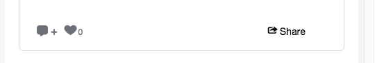

# Storify CSS Classes{#storify-css-classes}

適用於Storify應用程式的CSS類別。

使用CSS自訂Storify應用程式，只要使用您自己的樣式表覆寫預設CSS，即可與頁面進行更完整的整合。 本節說明可用的CSS自訂。

## 作者元素{#section_tdy_hsh_xz}

可讓您自訂貼文作者頭像、作者名稱和時間戳記的樣式。

| 類別 | 說明 |
|---|---|
| .s-author-name | 作者 |
| .s-author-avatar | 作者的頭像。 |
| .s-img | 作者的頭像。 |
| .s-timestamp | 發佈日期內容的時間戳記。 |

## 標題元素{#section_nbv_gsh_xz}

可讓您自訂內文頁面的頁首區段。

| **類別** | **說明** |
|---|---|
| .super-header | 首頁首 |
| .outer-header | 主標題行1 |
| .s倒計時 | 主報頭行1倒計時器 |
| .s-liveness | 主標題行1 &quot;Live&quot;狀態 |
| .base-header | 主標題行2 |
| .s-dropdown | 主標題列2排序下拉式觸發器。 |
| .s-dropdown-menu | 主標題行2排序下拉菜單。 |
| .s-dropdown-triangle | 主標題行2排序下拉菜單脫字元號。 |
| .s-dropdown-option | 主標題列2排序下拉式功能表項目。 |
| .s-views | 主標題行2的視圖數。 |
| .s-share-button按鈕 | 主標題行2 「共用」按鈕。 |
| .s-share-menu | 主標題列2 「共用」功能表。 |

## 貼文元素{#section_lrs_fsh_xz}

可讓您自訂貼文內文元素的樣式。

| **類別** | **說明** |
|---|---|
| .s-liveblog | 整個「內文」元素的容器 |
| .s-post | 貼文容器 |
| .s-modal-content | 後模式容器 |
| .s-element-content | 貼文內的所有內容元素 |
| .s-element-text ul | 文字元素 |
| .s-element-text h2 | 文字元素標題 |
| .s-element-text p | 文字元素段落 |
| .s-element-text ul | 文字元素無序清單 |
| .s-element-text ol | 文字元素順序清單 |
| .s-element-text li | 文字元素清單項目 |
| .s-element-text區塊引號 | 區塊引號 |
| .s-element-text塊引號：before | 區塊引號開頭的圖示 |
| .s-element-text塊引號：after | 區塊引號結尾的圖示 |
| .s-element-image | 內嵌影像元素容器 |
| .s-img | `` 元素 |
| .s-image-caption | 社交媒體上的影像和視訊標題(例如：Instagram影像) |
| .s-upload-image-caption | 透過「內文」編輯器上傳的影像和影片標題 |
| .s-element-video | 視訊元素 |
| .s-element-quote | 報價元素(例如：僅含文字的推文) |
| .s-element-quote-image | 含影像元素的報價(例如：含影像的推文) |
| .s-element-quote-video | 含視訊元素的報價(例如：含影片的推文) |
| .s-link-body | 報價內的連結預覽(例如：含連結預覽的推文) |

## 頁尾元素{#section_ozc_zrh_xz}

可讓您自訂每個貼文的頁尾區段。

| **類別** | **說明** |
|---|---|
| .s-後頁腳 | 貼文的頁尾。 |
| .s-sieras | 貼文頁尾中的「地標」按鈕。 |
| .s-like | 貼文頁尾中的「贊」按鈕。 |
