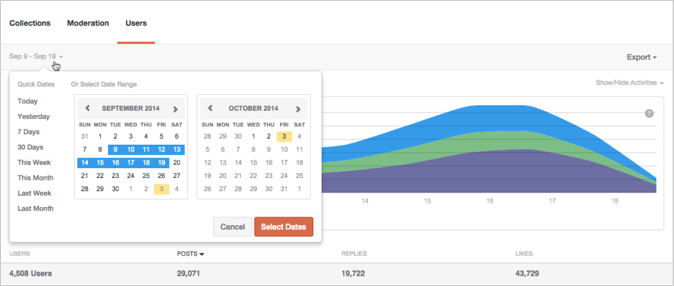

# Analytics{#analytics}

分析您網站的使用者、內容和版主活動。

## Analytics {#topic_22D8FAE581CD440EA02B1595520F60C2}

分析您網站的使用者、內容和版主活動。

Livefyre Analytics可讓您以簡單易懂的控制面板存取您的網路資料，取得對話、協調和使用者資料。 使用這些控制面板來監控活動並在您的網站上執行快速分析。

控制面板可依網站、日期和活動篩選。 使用窗口左上角的「網路」下拉清單選擇要顯示的網站。 產生後，按一下欄標題以排序，或將滑鼠移至圖形上方，以取得任何資料點的更多特定資訊。

本頁面說明：

* 為控制面板選取日期範圍
* 顯示/隱藏可用活動
* 匯出控制面板資料
* 集合控制面板
* 協調控制面板
* 使用者控制面板

>[!NOTE]
>
>Analytics目前支援源自Livefyre核心應用程式與協調的活動。 這些控制面板中包含的大部分活動也可透過Livefyre JavaScript事件取得，這些事件可用來支援您自己的自訂或第三方分析工具。

## 日期範圍 {#concept_798C438120E643B6BE262C9997DC87C4}

按一下日期下拉式清單，選取要顯示的範圍。 使用快速日期，或從提供的日曆中選擇開始和結束日期。

快速日期：

* **今天：** 顯示從當天午夜至此時刻前最後一個完整小時的資料。
* **昨天：** 顯示前24小時的資料。
* **7天：** 顯示前7天的資料，不包括今天。
* **30天：** 顯示前30天的資料，不包括今天。
* **本週：** 顯示從上週日的午夜至此時刻前最後一個完整小時的資料。
* **本月：** 顯示從當月第一天的午夜至此時刻前最後一個完整小時的資料。
* **上週：** 顯示上週的資料。
* **上個月：** 顯示上個月的資料。

## 顯示/隱藏活動 {#concept_022D9851CBCE4A2FB80D0AE52A23744D}

活動是使用者在您的網站上採取的動作，包括留言、標幟、共用和協調。 使用 **顯示/隱藏活動** 下拉清單以選取您要包含在控制面板中的活動。

>[!NOTE]
>
>為篩選器選取新事件將重新呈現頁面，而不變更URL。

可用活動因控制面板類型和匯出而異，可能包括：

* **貼文：** 顯示從當天午夜至此時刻前最後一個完整小時的資料。
* **答復：** 顯示前24小時的資料。
* **按贊次數：** 顯示前7天的資料，不包括今天。
* **不贊：** 顯示前30天的資料，不包括今天。
* **包含媒體：** 顯示從上週日的午夜至此時刻前最後一個完整小時的資料。
* **貼文含有像片上傳：** 顯示從當月第一天的午夜至此時刻前最後一個完整小時的資料。
* **貼文有連結：** 顯示上週的資料。
* **Post有@mentions:** 顯示上個月的資料。
* **已核准：** 顯示上個月的資料。
* **博佐德：** 顯示上個月的資料。
* **已清除：** 顯示上個月的資料。
* **協調總計：** 顯示上個月的資料。

## 匯出控制面板資料 {#concept_730DB61A9F894BE6BFB34E0E2A421ED3}

使用 **匯出** 功能表，將控制面板資料匯出為CSV檔案。

* 每日摘要（僅限集合）:匯出每個「集合」的上週完整每日計數。
* 表資料：匯出所有匯總的集合資料（目前報表中的所有欄和所有列）。
* 原始資料：會匯出用於建立目前統計報表的所有個別事件。

>[!NOTE]
>
>這些報表可能需要幾分鐘的時間才能匯出。 所有時間戳都是Unix時間。

## 集合 {#concept_228D8E5553784DB8BABF3819A5FF0345}

「集合」控制面板會依「集合」列出使用者活動，讓您決定最吸引（且最不吸引）的內容。 每個列出的集合都包含可在其中找到的頁面的連結。

## 協調 {#concept_98689B1E804B43CEA21E3F456107CCD9}

「協調」控制面板會依協調者列出事件，讓您評估其活動。 使用此報表來尋找您最活躍的協調者，以及最常見的協調動作。

>[!NOTE]
>
>會針對版主名稱Livefyre System列出自動化的Livefyre協調活動。

## 使用者 {#concept_D1A83E31C7B5467F9C844CBF9A740E12}

「使用者」控制面板會依使用者顯示網站活動，讓您分析個別使用者與您的網站互動的方式。 使用此控制面板來尋找整個網站中最活躍的使用者，並評估最受歡迎的網站活動。

