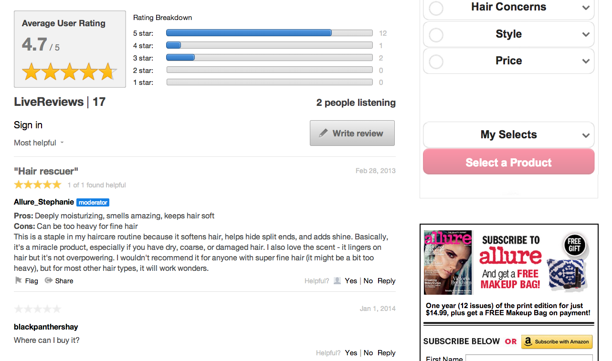

# 評論{#reviews}

即時在您的網站上評分及審核任何內容。

審核可讓使用者即時輕鬆地在您的網站上評分及檢閱產品、服務、文章或任何內容。

「檢閱」應用程式中張貼的每個「檢閱」包含一行「檢閱標題」、「內文」和「數值評分」。評論應用程式包括標題和評分，可量化使用者的意見，並提供使用者使用該產品或服務的摘要摘要。

預設的評論應用程式包含一個評論系列和一個摘要區段，可顯示該系列的「平均使用者評分和排名劃分」。使用者可即時閱讀並與評論互動。

Allure使用評論邀請他們的使用者對其功能的產品貢獻評分和意見。有了評論，Allure就可以從受眾獲得寶貴的個人意見回饋。

## 評論功能 {#section_awq_xph_21b}

評論提供幾個特定於此應用程式的功能。

* 快速視覺化呈現串流上方趨勢(星形分級和平均評分摘要)。
* 可自訂的分級介面，包括星形和其影像、分級(例如Profs和Cons)以及多種分級類別。
* 使用「平均使用者評分」的圖形視覺化和評論系列的「排名劃分」來摘要審核。
* 佇列評論以顯示，同時維持使用者檢視清單頂端的「檢閱」。
* 允許使用者對評論的協助進行投票，然後依最實用及/或最高評分排序。
* 適合行動裝置的介面。

