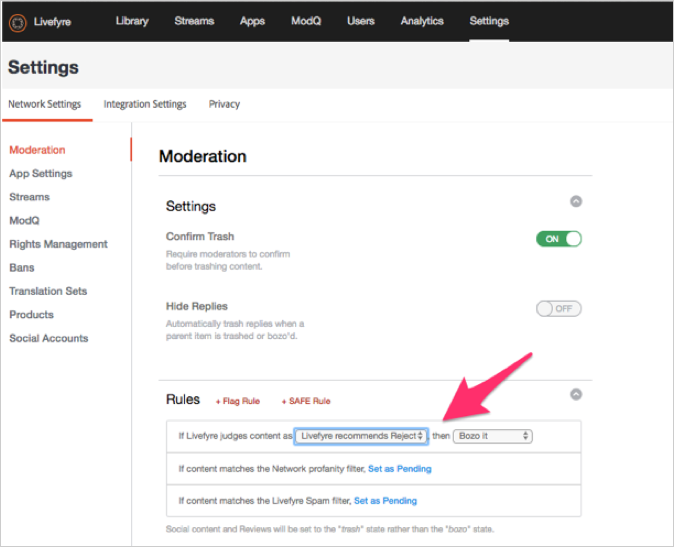

# 設定協調{#setting-up-moderation}

使用「協調」索引標籤來設定傳入內容的預先協調規則，包括褻瀆清單、標幟規則和禁止的IP位址。

## 協調的運作方式 {#section_kyf_gvc_t1b}

您可以以下列方式協調內容：

* 自動預先協調內容，以根據您在發佈內容之前設定的規則來篩選不想要的內容。
* 使用「資料庫」中的「ModQ」或「應用程式內容」，手動刪除或核准使用自動預協調來標幟的內容。
* 識別重複張貼冒犯性內容的網站訪客，以禁止特定Livefyre使用者、社交使用者或IP位址，以防止他們張貼。
* 透過允許列出使用者或關閉特定串流、網站或網路的篩選器，識別隨時可顯示的人物和內容。

您可以透過下列方式自動預先協調內容：

* 設定規則以自動標籤特定類型的內容：

   * 為網站訪客標幟的內容設定標幟規則，使用 **[!UICONTROL Settings > Moderation > Rules]**
   * 使用 **[!UICONTROL Settings > Moderation > Rules]**
   * 禁止特定Twitter使用者使用 **[!UICONTROL Settings > Streams]**
   * 禁止使用 **[!UICONTROL Settings > Bans]**
   * 依要求依國家／地區代碼禁止IP地區。 禁止的內容將標籤為垃圾郵件。

* 在「網路」或「網站」下方的「粗細清單」中，建立您認為 **[!UICONTROL Settings > Moderation > Rules]** 粗細的字詞清單。
* 使用或關閉特定串流、網站或網路的篩選條件，允許清單使用者（一律允許顯示這些使用者的內容）。

在設定了您的褻瀆清單、SAFE篩選器和規則後，您可以選擇是否預先協調內容並在串流中套用SAFE篩選器。 如需詳細資訊，請參 [閱所有串流規則的串流規則選項](/help/using/c-streams/c-stream-rule-options-for-all-stream-rules.md#c_stream_rule_options_for_all_stream_rules)。

Livefyre將內容標 **[!UICONTROL Approved]**&#x200B;示為 **[!UICONTROL Pending]**、 **[!UICONTROL Junk]**&#x200B;等。 視內容的來源、發佈位置，以及您在系統中設定的規則而定。 下表詳細說明Livefyre採取的動作（視這些因素而定）。

## 協調的運作方式

| 內容來源： | 傳送內容至： | 核准狀態 |
|--- |--- |--- |
| 庫 | 應用程式 | 內容已核准 |
| 社交搜尋 | 應用程式 | 內容已核准 |
| 串流規則 | 應用程式 | 內容是否標示為「By SAFE（安全性）」篩選器的垃圾？  <ul><li>否——串流至應用程式協調工作流程</li><li>是——內容被刪除</li></ul> |
| 庫 | 資料夾 | 無狀態（在資料夾中、未發佈、未刪除） |
| 社交搜尋 | 資料夾 | 無狀態（在資料夾中、未發佈、未刪除） |
| 串流規則 | 資料夾 | 內容是否標示為「By SAFE（安全性）」篩選器的垃圾？  <ul><li>否——無狀態（在資料夾中、未發佈、未刪除）</li><li>是——內容被刪除</li></ul> |
| 應用程式貼文 | 應用程式 | 內容是否標示為「By SAFE（安全性）」篩選器的垃圾？  <ul><li>否——貼文至應用程式協調工作流程</li><li>是——內容被刪除</li></ul> |

## 串流至應用程式協調工作流程 {#section_z5z_w4d_t1b}

在將串流的內容發佈至應用程式之前，Livefyre會執行下列檢查，以決定如何處理內容：

1. 如果SAFE將內容標示為無用品或丟棄，Livefyre會將內容轉換。
1. 如果SAFE未將內容標示為無用品，Livefyre會檢查是否開啟預先協調。
1. 如果已開啟預先協調，Livefyre會將內容標示為待審。
1. 如果您設定ModQ規則，Livefyre會將內容傳送至ModQ。
1. 如果未開啟預先協調，Livefyre會檢查SAFE是否標籤內容。
1. 如果SAFE已標幟內容，Livefyre會核准內容並將內容發佈至應用程式。
1. 如果SAFE標示內容，而您未設定SAFE規則，則Livefyre會核准內容並將內容發佈至應用程式。
1. 如果SAFE標示內容，而您設定了SAFE規則，Livefyre會檢查您是否為串流設定了SAFE規則。
1. 如果您為串流設定SAFE規則，Livefyre會核准內容並將內容發佈至應用程式。 如果您未為串流設定SAFE規則，Livefyre會使用協調SAFE規則來決定如何處理內容（傳送至ModQ、垃圾筒等）。

## 應用程式貼文協調工作流程 {#section_fwn_w4d_t1b}

在將應用程式貼文的內容發佈至應用程式之前，Livefyre會執行下列檢查以決定如何處理內容：

1. 如果SAFE篩選器將內容標示為drop,Livefyre會丟棄內容。
1. 如果SAFE未將內容標示為drop,Livefyre會檢查是否開啟預先協調。 如果已開啟預先協調，Livefyre會將內容標示為待審。 如果您設定ModQ規則，Livefyre會將內容以待定狀態傳送至ModQ。 如果沒有，內容會在「資料庫」的「應用程式內容」中保持擱置狀態。
1. 如果未開啟預先協調，Livefyre會檢查SAFE是否標籤內容。 如果沒有，Livefyre會核准內容，並將內容發佈至應用程式。
1. 如果SAFE標示內容並您設定SAFE規則，Livefyre會使用SAFE規則來決定如何處理內容（傳送至ModQ、垃圾筒等）。 如果SAFE標示內容，而您未設定SAFE規則，則Livefyre會核准內容並將內容發佈至應用程式。

## 大量篩選 {#section_lyk_ktx_vy}

「大量篩選」會尋找在短時間內發佈至所有Livefyre網路的重複性內容。 如果偵測到此內容，則會標幟為「大量」，然後依預設進行轉譯。 雖然大量內容可能是使用者產生的（例如「觸及式降低！」） 在熱門的足球賽中，多次張貼在「聊天」中)，大部分都源自垃圾訊息宣傳。 此篩選器與語言無關，可與任何語言搭配使用。 若要自訂大量篩選，您必須聯絡Livefyre支援。

## 規則 {#section_gqz_ksk_f1b}

使用「規則」區段可以根據SAFE和使用者套用的標幟，建立預先協調規則。 此面板提供兩種規則：

* **[!UICONTROL Flag Rules:]** 指定應對由使用者標幟之留言執行的已定義次數動作。
* **[!UICONTROL SAFE Rules:]**將SAFE標幟與對標幟內容採取的動作結合。

若要建立「標幟規則」，請選取標幟（進攻性、關閉主題、不同意或垃圾訊息），輸入必須套用至某個內容的次數，並選取要採取的動作。 您可以為每個標幟選項設定一個標幟規則（進攻、關閉主題、不同意或垃圾訊息）。

您可以在網路、網站和串流層級建立規則。 除非您以不同方式設定網站規則，否則網站層級規則會繼承網路規則。 串流規則會繼承網站規則，除非您以不同方式設定規則。

可用動作：

* **[!UICONTROL Trash it:]**將標幟的留言傳送至垃圾筒。
* **[!UICONTROL Bozo it:]** 隱藏已標幟的留言，讓除其寫入者外的所有使用者看得到。
* **[!UICONTROL Pending:]** 將內容設為待定。 如果您在下方將「預協調」設 **[!UICONTROL Settings > ModQ]**&#x200B;為「開啟」，則會在「ModQ」中。 否則，它只會出現在「應用程式內容」中。

>[!NOTE]
>
>Livefyre建議您建立規則給被5位使用者標幟為「垃圾訊息」或「冒犯性」的Bozo留言。

## 協調建議 {#section_ec3_vr3_2cb}

您可以使用協調建議來協助您判斷如何協調網站訪客在Livefyre應用程式中張貼的內容。 「協調建議指標」會根據您先前對類似內容採取的動作，建議您何時可能刪除某段內容。 若要使用協調建議：

1. 聯絡您的Adobe Livefyre支援專業人員，以開啟「協調建議」功能。
1. 在網路設定中設定協調建議。

   使用下方的設定設定 **[!UICONTROL Livefyre Recommends Trash]** 協調建議 **[!UICONTROL Network Settings]**。

   

1. 設定SAFE規則，告訴Livefyre如何處理協調建議識別為可能被轉換的內容。 如需如何為選項設定SAFE規則的詳細資訊，請參 **[!UICONTROL Livefyre Recommends Trash]** 閱協 [調](/help/using/c-features-livefyre/c-about-moderation/c-moderation.md#c_moderation)。

   

1. 使用ModQ **[!UICONTROL Moderation Recommendation Indicator]** 或「應用程式內容」中的，篩選協調建議識別為可能被轉換的內容。

   在ModQ中，指示器如下所示：  

   如需如何使用協調建議來協調ModQ中內容的詳細資訊，請參 [閱ModQ](/help/using/c-features-livefyre/c-about-moderation/c-modq.md#c_modq)。

   在「應用程式內容」中，協調建議的外觀如下：  

   如需如何在應用程式內容中使用協調建議的詳細資訊，請參閱「使用應 [用程式內容協調內容」](/help/using/c-features-livefyre/c-about-moderation/c-moderate-content-using-app-content.md#c_moderate_content_using_app_content)。
