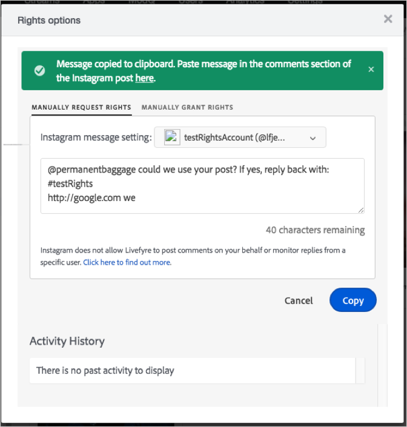

# 傳送部分自動化Instagram權限請求{#send-a-partially-automated-instagram-rights-request}

您可以要求使用部分自動化工作流程，重復使用由作者(商業帳戶)從搜尋或串流取得的Instagram資產。

您必須先傳送部分自動化權限要求，才能：

* 新增Instagram商業帳戶。如需如何設定Instagram業務帳戶的詳細資訊，請參閱 [關於Instagram帳戶](../c-users-creating-accounts-with-studio-access/t-configure-social-accout-instagram/c-about-instagram-accounts.md#c_about_instagram_accounts)。
* 設定Rights Management。如需如何設定權限管理的詳細資訊，請參閱 [請求權限](../c-how-requesting-rights-works/c-how-requesting-rights-works.md#c_how_requesting_rights_works)。

若要使用部分自動化工作流程，從商業帳戶作者請求來自Instagram的權利：

1. 開啓 **[!UICONTROL Rights options]** 視窗。
1. 選取用於請求權限的帳戶。帳戶必須是Instagram的商業帳戶。
1. (選擇性)編輯請求訊息。如果訊息遺失或必要元素拼錯，會顯示錯誤訊息，指出錯誤或遺失資訊。
1. 按一下 **[!UICONTROL Copy]** ，將方塊中的文字複製到剪貼簿中。

   

   Livefyre會自動將文字從方塊複製到剪貼簿，並顯示確認您已複製文字的訊息。

1. 按一下確認訊息中的連結，開啓包含您請求權限之資產的貼文。

   

   Livefyre會在Instagram開啓貼文。

1. 將複製的版權要求文字貼到Instagram上Instagram貼文中。
1. 當使用者回應時，Livefyre會自動授予Livefyre內容的權限。

Livefyre會追蹤何時傳送權限請求、使用者回應時以及何時授予資產權限。
