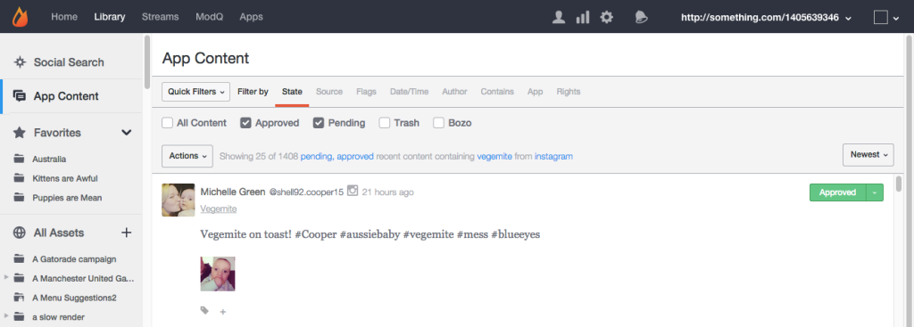

# 應用程式內容索引標籤{#app-content-tab}

跨Livefyre網路管理內容。

您的Library中的「應用程式內容」索引標籤可讓您搜尋並協調應用程式中發佈的內容。**[!UICONTROL App Content]** 此標籤可讓數個搜尋篩選器使用萬用字元搜尋，讓您更快速輕鬆地定義搜尋參數。

使用「應用程式內容」索引標籤，可以：

* 搜尋內容
* 檢視內容歷史記錄
* 協調內容
* 新增標記
* 功能內容
* 將內容與產品目錄中的產品建立關聯

如需如何使用「應用程式內容」索引標籤協調內容的詳細資訊，請參閱 。

## 萬用字元搜尋 {#section_jvr_ntm_zz}

Livefyre搜尋欄位支援萬用字元，可讓您將星號(*)新增至字詞(或字片段)，以擷取部分相符項目。

例如：

* ball只傳回ball
* ball*傳回球和氣球
* *棒球傳回足球和足球
* * ball* return ball and uniquall and sorbabled

## 搜尋內容 {#section_fw1_mtm_zz}

「應用程式內容」面板可讓您使用數個不同的內容篩選選項縮小搜尋範圍。

使用 **[!UICONTROL Quick Filters]** 分頁將傳回的內容縮小至 **[!UICONTROL All Content]** **[!UICONTROL All Sidenotes]** **[!UICONTROL Approved]** **[!UICONTROL Approved & Flagged]**、 **[!UICONTROL Pending]** **[!UICONTROL Rights Requests]** 或狀態。然後選取 **[!UICONTROL Filter by]** 選項，然後使用核取方塊或輸入欄位來縮小搜尋範圍。

使用下拉式選單來排序清單中的內容， **[!UICONTROL Newest]** **[!UICONTROL Oldest]**、或 **[!UICONTROL Recently updated]** **[!UICONTROL Most flags]** **[!UICONTROL Most liked]**。

## 依選項篩選 {#section_aqn_xqm_zz}

使用 **[!UICONTROL Filter by]** 列來依下列選項進行篩選：

* **狀態** 可讓您依內容的目前協調狀態進行篩選：** [!UICONTROL All Content]** **[!UICONTROL Approved]**、 **[!UICONTROL Pending]** **[!UICONTROL Bozo]** 或。

* **來源** 可讓您依內容來源進行篩選。選取 **[!UICONTROL Livefyre]** 以列出直接張貼在串流中的使用者產生的內容。選取 **[!UICONTROL Facebook]**、 **[!UICONTROL Twitter]** 或 **[!UICONTROL RSS]** 將內容納入這些來源中的應用程式中。

* **標幟** 選擇標幟可讓您依據(垃圾郵件 **[!UICONTROL User Flags]** 、離案、冒犯性或不同意)進行篩選， **[!UICONTROL System Flags]** 由SAFE(褻瀆、垃圾訊息或惡意協調)套用 **[!UICONTROL Moderation Recommendations]**。 

* **日期/時間** 可讓您在內容原始 **[!UICONTROL Created]** (或透過SocialSync或Stream提取到應用程式中)或最後一個 **[!UICONTROL Modified]** (編輯、標記或狀態變更)時進行處理。

* **作者** 可讓您依作者 **[!UICONTROL IP]** 的地址進行篩選( **[!UICONTROL Display Name]** 在「使用者」面板上或從作者張貼的內容上方)，或 **[!UICONTROL User ID]** (在「使用者」面板上找到)。

* **Contains** Allows you to filter the most recent 90 days of content by **[!UICONTROL Keyword]** or **[!UICONTROL Content Tag]**. 選取 **[!UICONTROL Media]** 核取方塊，只傳回包含媒體的內容。(若要搜尋所有內容，請向下捲動至清單中的所有內容，然後按一下 **[!UICONTROL Search full data]**。)

   **注意：** 不支援多個關鍵字和內容標籤搜尋。如果輸入多個關鍵字或標籤，則會使用最後一個字詞進行搜尋。

   依內容標記搜尋時，建議標記在您輸入搜尋欄位時自動填入。搜尋結果會傳回已指派標籤的所有內容。(使用此欄位搜尋主要內容，或按一下Studio中任何精選內容 **[!UICONTROL Featured]** 的標籤)。

   **注意：** 使用減號(-)記號在標籤名稱之前，搜尋未包含該標記的內容。例如：搜尋「-Miley」，搜尋所有不包含「Miley」標籤的內容。

* **應用程式** 可讓您依 **[!UICONTROL Collection ID]**、 **[!UICONTROL App Tag]** 或 **父ID進行篩選**。「依父項ID篩選」會傳回回覆至輸入內容ID的所有內容。(輸入以逗號分隔的標記，以篩選多個標記)。

* **權限** 可讓您依「權限請求」狀態進行篩選：** [!UICONTROL Requested]** **[!UICONTROL Granted]**、 **[!UICONTROL Replied]** **[!UICONTROL Expired]** 或。

## 機器人內容 {#section_afl_vqm_zz}

在應用程式中 **[!UICONTROL Bozo]**，內容只會顯示給內容的作者。這可讓使用者相信他們的內容已獲得核准，並將其隱藏給其他使用者和協調者。

>[!NOTE]
>
>使用SocialSync或Streams **[!UICONTROL cannot]** 的Social內容會設定為Bozo。

基於下列原因，您可以使用Botzo內容：

* 經SAFE識別為垃圾訊息的內容會自動設為Botzo狀態。
* 「受禁止使用者」的所有內容都會自動設為Botzo。
* Studio中可能會標示「內容」的字樣。
* 協調者可直接在串流中使用Botzo內容。

## 檢視內容歷史記錄 {#section_ayz_tqm_zz}

內容面板可讓您檢閱所有列出內容的記錄，包括預先協調、垃圾郵件篩選、張貼日期，以及指派給項目的任何使用者標幟或附註。

使用內容面板底部的標籤來檢視其歷史記錄。

* **[!UICONTROL More Info:]** 列出此內容的所有活動，包括提交、編輯、垃圾郵件檢查、狀態變更和附註。此區段也會顯示Livefyre內容ID和使用者的IP位址。
* **[!UICONTROL Replies:]** 最多可列出個回覆。按一下 **[!UICONTROL Show all replies]** 以顯示貼文的所有回覆。

* **[!UICONTROL Flags & Reports:]** 列出所有使用者標幟，以及標幟內容的使用者的頭像，以及任何使用者在標幟內容時新增的任何報表(附註)。
* **[!UICONTROL Add a note:]** 可讓您新增附註，供其他管理員或協調者看到。
* **[!UICONTROL Request Rights:]** 開啓 **[!UICONTROL New Rights Request]** 對話方塊，可從此處發出Rights Request。

* ****[!UICONTROL Save as Asset:]開啓 **[!UICONTROL Advanced Options]** 對話方塊，可讓您將選取的項目儲存至資產庫、將其發佈至應用程式，或請求從其作者重復使用權限。

## 新增標記至內容 {#section_xb4_mxr_rdb}

標記內容可讓您分類和組織內容，以輕鬆進行擷取和樣式自訂，或標示內容。

若要新增標記，只需按一下內容下方的加號( **[!UICONTROL +]** )圖示即可。輸入新標記，或從現有標記清單中選取。

## 搜尋所有資產中的影像 {#section_zxf_hsf_wcb}

當您將內容新增至程式庫後，就可以使用智慧標籤來搜尋內容。

在「資料庫(Library)」中，在「所有資產(All Assets)」下方，您可以按一下 **[!UICONTROL Show Filters]** 然後再按一下：

* 輸入要在搜尋欄位中搜尋的文字
* 依相關性排序
* 在 **[!UICONTROL Tags]** 欄位中輸入文字，以供智慧標記搜尋。智慧標籤排名演算法使用智慧標記信賴分數、新內容的新增方式以及使用者提供內容的星號來篩選內容。

## 主要內容 {#section_emb_kqm_zz}

選取預設 **[!UICONTROL Featured]** 標記以標示內容，並將其反白標示為對使用者重要。標記之後，使用自訂樣式選項自訂應用程式中的「精選內容」。

## 至功能或取消功能內容 {#section_ojx_3qm_zz}

* 從Studio，按一下內容旁 **[!UICONTROL +]** 的符號，選取下拉式清單中的 **[!UICONTROL Featured]** 標籤，然後按一下 **[!UICONTROL Enter]** 「功能」內容。標籤會儲存並顯示在內容的旁邊。

* 若要取消功能， **[!UICONTROL x]** 請按一下內容上顯示 **[!UICONTROL Featured]** 的標籤。

* 從Comments、Live部落格或評論應用程式中，將滑鼠指標暫留在您要功能的內容上，然後按一下 **[!UICONTROL Feature]**。若要取消功能，只需將滑鼠指標暫留在內容上，然後按一下 **[!UICONTROL Unfeature]** 即可。

>[!NOTE]
>
>由於空間限制，聊天內容只能使用Studio精選或不提供，而且可能不會在應用程式本身內提供特色。

## 編輯精選內容 {#section_pyw_hqm_zz}

對於內容的一般動作，可在精選內容上進行，但下列除外：

* 無法標幟主要內容。
* 使用者無法編輯其內容後加以編輯，但他們仍可將其刪除。協調者可編輯精選內容。

