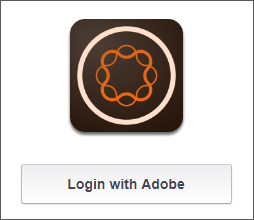
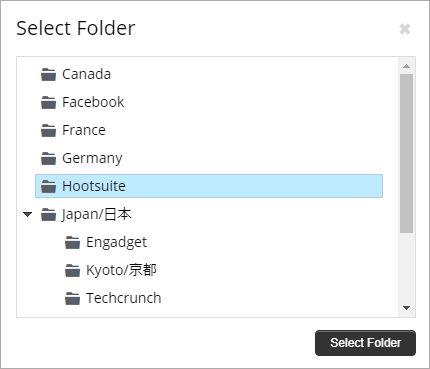

# 使用Adobe Experience Manager Livefyre搭配Hootsuite{#use-adobe-experience-manager-livefyre-with-hootsuite}

瞭解如何使用HootSuite使用Experience Manager Livefyre，讓您直接從HootSuite儀表板策劃、管理和分享使用者產生的內容。

## 使用Adobe Experience Manager Livefyre搭配Hootsuite {#topic_FB6E613DBCF74F39ABD5045C501EA326}

瞭解如何使用HootSuite使用Experience Manager Livefyre，讓您直接從HootSuite儀表板策劃、管理和分享使用者產生的內容。

## 快速入門 {#task_22699BD901C24384AB2DC02D926D8F4A}

任務內容

1. 從Hoosuite App Directory安裝Adobe Experience Manager Livefyre for HootSuite。

1. 從Hootsite儀表板，按一下 **Adobe的登入**。

   

1. 使用Livefyre認證登入Experience Manager Livefyre。
1. 按一下 **「授權** 」以授與HootSuite存取您的程式庫的權限。

   

   在取得權限後，您將會返回HootSuite儀表板，以便在Experience Manager Livefyre程式庫中搜尋資產。

## 搜尋資產 {#task_0B011B0C539E400BB72A6DF69FBF66C0}

任務內容

1. 按一下選單列中的搜尋圖示，即可搜尋Experience Manager Livefyre程式庫中的資產。

   

1. 按一下 **「選取」** 並將快顯視窗與所有資料庫一起顯示。
1. 按一下資料庫的資料夾，然後按一下 **「選取資料夾** 」以選取將顯示在HootSuite串流中的程式庫。

   

## 篩選選項 {#concept_5D062A9CD61A4B2E90784E5AA31CB16D}

您可以使用「顯示資產來源」、「權限」、「關鍵字」和「標記」區段來篩選搜尋結果。

篩選選項包括：

| 區段 | 說明 |
|--- |--- |
| 顯示資產來源 | 選取從所有來源或單個來源檢視資產。例如：Instagram、Twitter、Facebook等 |
| Rights | 選取僅檢視具有特定權限設定的資產。 |
| 關鍵字 | 選取以依關鍵字或標記篩選結果。依據關鍵字篩選會搜尋貼文的文字內容以及作者顯示名稱和作者使用者名稱。 |
| 標記 | 選取以依關鍵字或標記篩選結果。依據關鍵字篩選會搜尋貼文的文字內容以及作者顯示名稱和作者使用者名稱。 |

選取搜尋參數後，您的資產將在搜尋時顯示在串流中：

### 串流功能表選項

按一下使用者的名稱或圖示會顯示個別網路上的使用者。按一下時間會顯示原始文章。當滑鼠指標超過項目時，會出現更多選項。按一下共用 

圖示會將目前資產新增至網路合成方塊，讓您透過HootSuite與您的網路共用。

>[!NOTE]
>
>只有當您要篩選具有授予權限的資產時，才會顯示共用按鈕。

按一下「指派  」圖示，將目前項目指派給其中一個HootSuite團隊成員。如果已指派項目，則解決 

圖示會出現。按一下以解決目前的指派工作。

### 其他應用程式功能表

按一下設定 

圖示可讓您中斷目前Experience Manager Livefyre帳戶的連線，並與其他帳戶連線。

按一下功能表 

圖示會顯示本文件、支援和Synaptive網站的連結。

## Experience Manager Livefyre App Plugin {#task_33C8CEF4F5E44830B970BB3A7AAA2AA6}

除了能夠在HootSuite串流中顯示資產庫外，您還可以將來自Instagram、Twitter、Facebook和YouTube串流的項目儲存至Experience Manager Livefyre程式庫。

1. 按一下每個項目底部的「功能表」圖示。

   

1. 選取 **「傳送至AEM Livefyre**」。
1. 選取一或多個程式庫以儲存資產。

   

1. 按一下 **「儲存至程式庫**」，項目就會儲存至您選取的程式庫。

## Experience Manager Livefyre Media Library元件 {#task_9CA2D5D49F8E463F9EF475BC09C8ACC9}

您可以透過HootSuite Composer的Media Components存取您的資產。

1. 在Composer中，按一下「媒體」區段中 **的「開啓媒體庫****** 」連結。

   

1. 從下拉式選單中選取「Adobe Experience Manager Livefyre」，您的檔案將會顯示。

   

1. 若要將資產新增至目前的貼文，請按一下。若要搜尋特定資產，請在 **「搜尋媒體** 」方塊中輸入搜尋詞，然後顯示結果。
