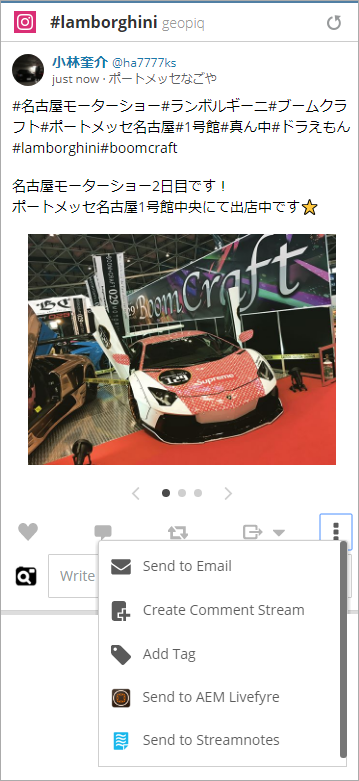

# 搭配使用Adobe Experience Manager Livefyre與Hootsuite{#use-adobe-experience-manager-livefyre-with-hootsuite}

瞭解如何搭配Hootsuite使用Experience Manager Livefyre，讓您直接從Hootsuite儀表板組織、管理和共用使用者產生的內容。

## 搭配Hootsuite {#topic_FB6E613DBCF74F39ABD5045C501EA326}使用Adobe Experience Manager Livefyre

瞭解如何搭配Hootsuite使用Experience Manager Livefyre，讓您直接從Hootsuite儀表板組織、管理和共用使用者產生的內容。

## 快速入門 {#task_22699BD901C24384AB2DC02D926D8F4A}

任務上下文

1. 從Hootsuite應用程式目錄安裝Adobe Experience Manager Livefyre for Hootsuite。

1. 在您的Hootsuite儀表板中，按一下「使用Adobe **登入」。**

   

1. 使用您的Livefyre認證登入Experience Manager Livefyre。
1. 按一下「授權&#x200B;****」，授予Hootsuite存取您資料庫的權限。

   

   一旦您授與權限，您將會回到Hootsuite儀表板，您可在儀表板中搜尋Experience Manager Livefyre程式庫中的資產。

## 搜尋資產 {#task_0B011B0C539E400BB72A6DF69FBF66C0}

任務上下文

1. 按一下功能表列中的搜尋圖示，以搜尋Experience Manager Livefyre程式庫中的資產。

   

1. 按一下「**選擇**」，彈出畫面就會顯示您所有的程式庫。
1. 按一下資料庫的資料夾，然後按一下「選取資料夾&#x200B;**」，以選取將顯示在Hootsuite串流中的資料庫。**

   

## 篩選選項 {#concept_5D062A9CD61A4B2E90784E5AA31CB16D}

您可以使用「顯示資產來源」、「權限」、「關鍵字」和「標籤」區段來篩選搜尋結果。

篩選選項包括：

| 區域 | 說明 |
|--- |--- |
| 顯示資產來源 | 選擇以從「所有來源」或從單一來源檢視資產。 例如：Instagram、Twitter、Facebook等 |
| 權利 | 選取以僅檢視具有特定權限設定的資產。 |
| 關鍵字 | 選擇以依「關鍵字」或「標籤」篩選結果。 依關鍵字篩選會搜尋貼文的文字內容，以及作者的顯示名稱和作者使用者名稱。 |
| 標記 | 選擇以依「關鍵字」或「標籤」篩選結果。 依關鍵字篩選會搜尋貼文的文字內容，以及作者的顯示名稱和作者使用者名稱。 |

在您選取搜尋參數後，當您搜尋時，資產會顯示在串流中：

### 串流功能表選項

按一下用戶的名稱或表徵圖將顯示相應網路上的用戶。 按一下時間會顯示原始文章。 當您的滑鼠移到項目上方時，將會出現更多選項。 按一下共用

表徵圖會將當前資產添加到網路合成框中，允許您通過Hootsuite與網路共用該資產。

>[!NOTE]
>
>只有當您篩選具有已授權權限的資產時，才會顯示共用按鈕。

按一下「指派」圖示，將目前項目指派給您的Hootsuite團隊成員。 如果已分配項目，則解析

表徵圖。 按一下它可解析當前分配。

### 其他應用程式選單

按一下「設定」

圖示可讓您中斷目前Experience Manager Livefyre帳戶的連線，並與另一個帳戶連線。

按一下菜單

表徵圖將顯示此文檔、支援和Synaptive網站的連結。

## Experience Manager Livefyre App Plugin {#task_33C8CEF4F5E44830B970BB3A7AAA2AA6}

除了能夠在Hootsuite串流中顯示資產資料庫外，您也可以將Instagram、Twitter、Facebook和YouTube串流中的項目儲存至Experience Manager Livefyre資料庫。

1. 按一下每個項目底部的「功能表」圖示。

   

1. 選擇「傳送至AEM Livefyre **」。**
1. 選取一或多個程式庫以儲存資產。

   

1. 按一下「儲存至程式庫&#x200B;**」，項目就會儲存至您選取的程式庫。**

## Experience Manager Livefyre媒體庫元件{#task_9CA2D5D49F8E463F9EF475BC09C8ACC9}

您可以透過Hootsuite Composer的媒體元件存取您的資產。

1. 在「編寫器」中，按一下&#x200B;**Media**&#x200B;部分中的&#x200B;**開啟媒體庫**&#x200B;連結。

   

1. 從下拉式選單中選取「Adobe Experience Manager Livefyre」，您的檔案就會顯示。

   

1. 若要將資產新增至您正在撰寫的目前貼文，請按一下。 若要搜尋特定資產，請在&#x200B;**搜尋媒體**&#x200B;方塊中輸入搜尋詞，並顯示結果。
