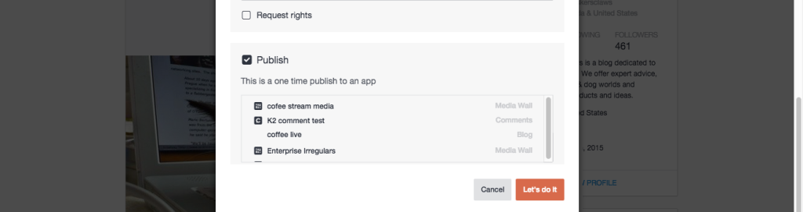

# 發佈內容{#publish-content}

直接將內容發佈至應用程式。

直接發佈至應用程式的內容不會儲存在您的資產庫中。

1. **[!UICONTROL View Details]** 的URL。
1. 從&#x200B;**[!UICONTROL Advanced Options]**&#x200B;對話框中選擇&#x200B;**[!UICONTROL Publish]**&#x200B;複選框。
1. 選取項目應發佈至的應用程式。
1. 按一下 **[!UICONTROL Let’s do it]**.
