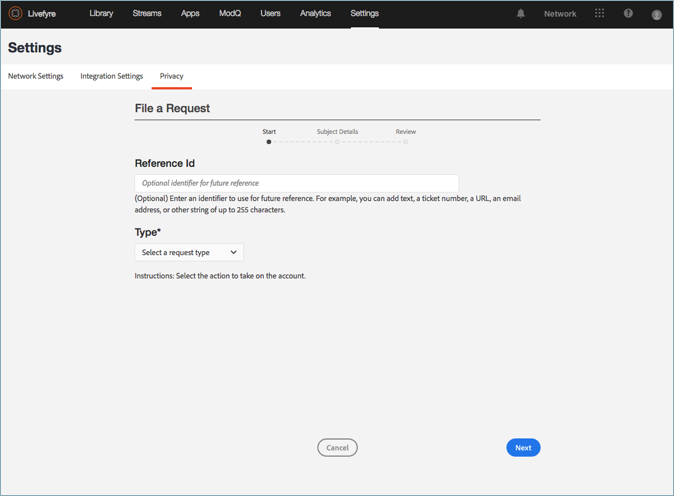

# 建立隱私權要求{#create-a-privacy-request}

在Livefyre中建立隱私權要求。

刪除使用者的所有資料、產生使用者所有資料的報表，並使用此程式進行選擇加入或選擇退出變更。

要搜索和查找用戶並生成其內容的報告，請執行以下操作：

1. 前往&#x200B;**[!UICONTROL Settings > Privacy]**，然後按一下&#x200B;**[!UICONTROL Create Request]**。

   

1. 在&#x200B;**[!UICONTROL Submit Request]**&#x200B;視窗中填寫資訊：

   * **[!UICONTROL Reference Id]**。輸入要用於將來參考的標識符。 例如，您可以新增最多255個字元的文字、票證編號、URL、電子郵件地址或其他字串
   * **[!UICONTROL Type]**

      * **存取**. 收集與帳戶關聯的所有可用資料。 敏感性詳細資訊（例如密碼或社交憑證）將被模糊化或省略。

      * **刪除**. 設定或模糊化與帳戶相關的所有資料。 **如果您選擇此選項並按一下「提交」，則無法撤銷或取消此動作，也 *無法復原已刪除的資料。*** 如果帳戶屬於Livefyre Studio使用者，則會保留部分資料，以維護您商業記錄的完整性。

         >[!IMPORTANT]
         >
         >刪除帳戶的資料將永久刪除或銷毀與該帳戶關聯的資料。 您無法反轉此動作，也無法在刪除後恢復資料。

      * **選擇退出**。防止Livefyre透過串流或社交搜尋被動地從社交帳戶收集資料或內容。 選擇加入和選擇退出不適用於註冊使用者
      * **選擇加入**。重新啟用Livefyre，可被動地從先前透過串流或社交搜尋選擇退出的社交帳戶收集資料或內容。 選擇加入和選擇退出不適用於註冊使用者

      

   * **[!UICONTROL Identifier Type]**&#x200B;和&#x200B;**[!UICONTROL Identifier]**

      * **[!UICONTROL User Account]**

         * 由您的使用者管理系統或Livefyre的Studio使用者識別碼產生的使用者帳戶ID來識別已註冊使用者的帳戶。 您也可以在&#x200B;**Livefyre****使用者設定**&#x200B;的「使用者詳細資訊」中，或在&#x200B;**資產庫**&#x200B;或&#x200B;**應用程式內容**&#x200B;的內容詳細資訊中找到使用者帳戶ID

         * 允許的值：英數字串，最多255個字元。 電子郵件地址不是有效的輸入
      * **[!UICONTROL Facebook User]**

         * 以Facebook提供的數位ID識別帳戶。 請求者應提供此資訊。 您可以找到如何找到數字FacebookID [的說明，此處](https://www.facebook.com/help/1397933243846983?helpref=faq_content)
         * 允許的值：6-16個數字字元
      * **[!UICONTROL Instagram User]**

         * 以Instagram提供的數位ID識別帳戶。 請求者應提供此資訊。 您可以透過線上搜尋，找到如何在Instagram帳戶上找到數位InstagramID的指示
         * 允許的值：5-16個數字字元
      * **[!UICONTROL Twitter User]**

         * 以Twitter提供的數位ID識別帳戶。 要求變更隱私權的人員應提供此資訊。 您可以透過線上搜尋，找到如何找到Twitter帳戶的數位TwitterID的指示
         * 允許的值：5-16個數字字元
      * **[!UICONTROL YouTube User]**

         * 以YouTube提供的數位ID識別帳戶。 要求變更隱私權的人員應提供此資訊。 您可以在[這裡找到如何在YouTube帳戶上找到數字YouTubeID的說明。](https://support.google.com/youtube/answer/3250431?hl=en)
         * 允許的值：5-16個數字字元
      * **[!UICONTROL Generic Author]**

         * 依Livefyre作者ID(JID)識別帳戶。 此選項適用於透過RSS、Tumblr或URL來源的內容。 若要尋找此ID，請在&#x200B;**App Content**&#x200B;或&#x200B;**Asset Library**&#x200B;中搜尋歸屬於「作者」的內容，然後選取項目。 此ID可在&#x200B;**App Content**&#x200B;的&#x200B;**Info**&#x200B;下，或在&#x200B;**Details**&#x200B;區段的&#x200B;**Author**&#x200B;下的&#x200B;**資產庫**&#x200B;中使用

         * 允許的值：英數字串，最多255個字元

         

1. 按一下 **[!UICONTROL Finish]**.

   

1. （僅適用於刪除請求）確認您要刪除使用者的所有資訊。

   >[!IMPORTANT]
   >
   >刪除帳戶的資料將永久刪除或銷毀與該帳戶關聯的資料。 您無法反轉此動作，也無法在刪除後恢復資料。
