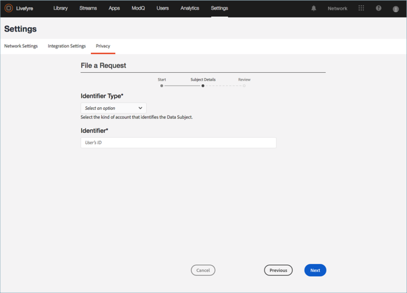

# 建立隱私權請求{#create-a-privacy-request}

在Livefyre中建立隱私權請求。

刪除使用者所有資料，產生使用者所有資料的報表，並使用此程序進行選擇加入或選擇退出的變更。

搜尋並尋找使用者並產生其內容的報表：

1. 前往 **[!UICONTROL Settings > Privacy]**，然後按 **[!UICONTROL Create Request]**一下。

   

1. 填寫 **[!UICONTROL Submit Request]** 視窗中的資訊：

   * **[!UICONTROL Reference Id]**. 輸入要供日後參考的識別碼。例如，您可以新增文字、票證號碼、URL、電子郵件地址或其他高達255個字元的字串
   * **[!UICONTROL Type]**

      * **存取**。收集與帳戶關聯的所有可用資料。敏感詳細資料(例如密碼或社交憑證)會被模糊化或遺漏。

      * **刪除**。切分或模糊化與帳戶關聯的所有資料。**如果您選擇此選項並按一下「送出」，則無法反轉或取消此動作， *也無法復原已刪除的資料。*** 如果帳戶屬於Livefyre Studio使用者，則會保留某些資料，以維持業務記錄的完整性。

         >[!IMPORTANT]
         >
         >刪除帳戶的資料將永久刪除或銷毀與帳戶關聯的資料。您無法反轉此動作，也無法在刪除資料後復原資料。

      * **選擇退出**。防止Livefyre透過串流或社交搜尋，被動收集來自社交帳戶的資料或內容。選擇加入和退出不適用於註冊使用者
      * **選擇加入**。重新啓用Livefyre，從先前選擇透過串流或Social搜尋選擇退出的社交帳戶，被動收集資料或內容。選擇加入和退出不適用於註冊使用者
      

   * **[!UICONTROL Identifier Type]** and **[!UICONTROL Identifier]**

      * **[!UICONTROL User Account]**

         * 由使用者管理系統產生的使用者帳戶ID或Livefyre的Studio User識別碼產生的使用者帳戶ID識別。您也可以在 **Livefyre****使用者設定** 中，或在 **資產庫** 或 **應用程式內容的內容詳細資訊中找到使用者詳細資料中的使用者帳戶ID**

         * 允許的值：最多255個字元的Alpha數字串。電子郵件地址不是有效的輸入
      * **[!UICONTROL Facebook User]**

         * 透過Facebook提供的數值ID識別帳戶。請求者應提供此選項。您可以找到如何在此處找到數值Facebook ID [的指示說明](https://www.facebook.com/help/1397933243846983?helpref=faq_content)
         * 允許的值：6-16個數值字元
      * **[!UICONTROL Instagram User]**

         * 由Instagram提供的數值ID識別帳戶。請求者應提供此選項。如需如何找到Instagram帳戶上數值Instagram ID的指示，請線上搜尋
         * 允許的值：5-16個數值字元
      * **[!UICONTROL Twitter User]**

         * 透過Twitter提供的數值ID識別帳戶。要求隱私權變更的人員應提供此選項。您可以找到如何透過線上搜尋找到Twitter帳戶的數值Twitter ID的指示
         * 允許的值：5-16個數值字元
      * **[!UICONTROL YouTube User]**

         * 由YouTube提供的數值ID識別帳戶。要求隱私權變更的人員應提供此選項。您可以找到如何在此處找到YouTube帳戶 [上的數值YouTube ID的指示說明](https://support.google.com/youtube/answer/3250431?hl=en)
         * 允許的值：5-16個數值字元
      * **[!UICONTROL Generic Author]**

         * 識別一個Livefyre作者ID(JID)的帳戶。將此選項用於RSS、Tumblr或URL來源的內容。若要尋找此ID，請搜尋屬於 **「應用程式內容** 」或 **「資產庫**」中「作者」的內容，然後選取項目。此ID可在「資訊」下方 ******的App** Content中或「詳細資料」區段中「作者」下的 **「資產庫****」****** 中使用

         * 允許的值：最多255個字元的Alpha數字串
         

1. 按一 **[!UICONTROL Finish]**下。

   

1. (僅限刪除請求)確認您要刪除使用者的所有資訊。

   >[!IMPORTANT]
   >
   >刪除帳戶的資料將永久刪除或銷毀與帳戶關聯的資料。您無法反轉此動作，也無法在刪除資料後復原資料。

