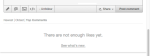
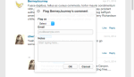

# 本地化字串{#localize-strings}

自訂Livefyre應用程式的字串。

您可以自訂任何Livefyre應用程式中大部分HTML元素的文字字串。如此可彈性地將轉換HTML元素的文字，例如「貼文As」按鈕、「注釋計數」文字或「登入」按鈕變更為任何有效的UTF-8字串。使用此功能可為您的串流建置增添個性，或為您的使用者群當地語系化應用程式。

* 留言、聊天和即時部落格

   * [實施](#c-localize-strings/section_im4_224_xz)
   * [帳戶存取](#c-localize-strings/section_cm3_d24_xz)
   * [串流資訊](#c-localize-strings/section_wx1_c24_xz)
   * [串流排序](#c-localize-strings/section_ih2_124_xz)
   * [內容資訊](#c-localize-strings/section_llv_yd4_xz)
   * [主要內容](#c-localize-strings/section_gmw_vd4_xz)
   * [文字編輯器](#c-localize-strings/section_ky5_td4_xz)
   * [回應選項](#c-localize-strings/section_zvt_qd4_xz)
   * [注釋通知](#c-localize-strings/section_qqt_pd4_xz)
   * [錯誤訊息](#c-localize-strings/section_omz_jxn_xz)

* [時間與日期格式](#c-localize-strings/section_yz4_g5n_xz)
* [Media Wall](#c-localize-strings/section_vwt_d5n_xz)
* [地圖](#c-localize-strings/section_fxv_c5n_xz)
* [Mosaic](#c-localize-strings/section_e2s_b5n_xz)
* [轉盤](#c-localize-strings/section_l2z_hkn_xz)
* [功能卡](#c-localize-strings/section_mw2_hkn_xz)
* [民調問答](#c-localize-strings/section_pdg_fwh_xz)
* [Livefyre身份識別](#c-localize-strings/section_zc3_xvh_xz)
* 更多:
   * [檢閱文字字串](/help/using/c-settings-other/c-translation-sets/c-review-text-strings.md#c_review_text_strings)
   * [Sitents](/help/using/c-settings-other/c-translation-sets/c-sidenotes-text-strings.md#c_sidenotes_text_strings)

## 實施 {#section_im4_224_xz}

若要實施此功能，請傳遞您要覆寫至JavaScript組態物件之字串的1-1物件對應。如果您未提供欄位，則會使用預設文字。

範例:

```
var customStrings = {     
   postAsButton: "New Post As Text",     
   postEditButton: "New Post Edit Text"  
};   
   convConfig["strings"] = customStrings; fyre.conv.load(     
   networkConfig,     
   [convConfig],     
   function(){}  
);
```

此頁面列出可為Livefyre核心應用程式自訂的所有文字字串。

## 帳戶存取 {#section_cm3_d24_xz}

用於驗證程序的字串，以及來自已驗證的使用者功能表的字串。


| 元素 | 索引鍵 | 預設文字 |
|---|---|---|
|  | DisplayName | %s |
|  | editProfile | 編輯描述檔 |
|  | notificationSettings | 通知設定 |
|  | SiteAdmin | 管理控制台(Studio連結) |
|  | SignOut | 登出 |

## 串流資訊 {#section_wx1_c24_xz}

用於內容串流資訊和顯示的字串。列出接聽人數、應用程式的貼文數目，以及允許使用者登入或存取其帳戶資訊。

| 索引鍵 | 預設文字 | 串流資料 |
|---|---|---|
|  | CommentCountLaberZero | %s注釋 |
|  | 注釋標籤 | %s注釋 |
|  | 注釋縮寫 | %s注釋 |
|  | ListenerCount | 個人監聽 |
|  | listenercountmtium | 受眾監聽 |
|  | LivePublishCount LabelZero | post |
|  | LivePublishCountLabel | post |
|  | liveVisitor costcovertimple | 貼文 |
| 執行緒選項 | social劃分按鈕 | 顯示整個執行緒 |
|  | laggleCollapse | 切換折疊 |
| 高速/佇列註解 | 重新整理 | 重新整理 |
|  | NewComment | 新留言 |
|  | NewComments | 新留言 |
|  | NewReprey | 新回覆 |
|  | 新回覆 | 新回覆 |

## 串流排序 {#section_ih2_124_xz}

允許依年齡或人氣來排序傳回的內容。



| 索引鍵 | 預設文字 | 頁首選項 |
|---|---|---|
|  | SortNewest | 最新 |
|  | sortorest | 最舊 |
|  | sortTopcomments | 熱門意見 |
|  | Sorthotreads | 熱門話題 |
|  | sortDisplator |  |  |
|  | Streaming | 正在載入 |
|  | topcommentContentNotectNotsg | 您仍然沒有足夠的喜好。 |
|  | HotPosisContentNotectMsg | 目前的執行緒不足。 |
|  | StreamreshRefsG | 查看新增功能。 |
| 頁尾選項 | archiveHeaderTitle | 從封存 |
|  | archiveShore更多資訊 | 顯示更多資訊 |
|  | 展示更多資訊 | 顯示更多注釋 |
|  | ShowMoreLiveBlog | 顯示更多貼文 |


## 內容資訊 {#section_llv_yd4_xz}

列出貼文資訊：使用者名稱、任何已套用的使用者標記，以及張貼時間。

  

| 索引鍵 | 預設文字 | 作者 |
|---|---|---|
|  | 協調者 | 協調者 |
|  | hoOverladewProfile | 檢視完整描述檔 |
| 貼文資訊 | TimeJustNow | 剛剛 |
|  | TimeminuteSago | 分鐘前 |
|  | timeminuteSagoMtium | 幾分鐘前 |
|  | TimeHursago | 小時前 |
|  | timehoursagoMtimum | 數小時前 |
|  | TimeDaysago | 一天前 |
|  | TimeDaysagoMtimum | 幾天前 |
|  | likestimple | 按贊次數 |
|  | likesingular | 贊 |
|  | ModatoredTimeStamp | 由協調者編輯 |
|  | CommentTomBstone | 此意見已刪除 |
|  | PermalinkNotFoundMsg | 此意見不再顯示。 |
|  | QuickProfileToolTip | 快速描述檔 |

## 主要內容 {#section_gmw_vd4_xz}

如果已啓用，則精選內容會列在串流頂端。

|  | 索引鍵 | 預設文字 |
|---|---|---|
| 主要標籤 |  |  |
|  | 功能評論STAG | 證言 |
|  | 功能字典 | 精選意見 |

## 文字編輯器 {#section_ky5_td4_xz}

依預設，所有使用者都可在頁面頂端取得。


|  | 索引鍵 | 預設文字 |
|---|---|---| 
| 編輯器按鈕 | following | +關注 |
|  | 取消關注 | - 取消關注 |
|  | LivePublish | 關注即時部落格 |
|  | LivePublisher | 取消關注即時部落格 |
|  | PostButton(適用於登入使用者)。 | 貼文留言 |
|  | PostSutton(適用於未驗證的使用者) | 貼文留言… |
|  | PostedButton | 編輯註解 |
|  | PostedasButton | 編輯註解… |
|  | PostedVisitButton | 取消 |
|  | editorDisabled | 此對話目前已關閉至新留言。 |
| 聊天選項 | LiveCathpostButtonLabel | 貼文 |
|  | LiveCathotedEdButton | 編輯 |
|  | LiveCathWindowsInStryure | 按下控制+輸入以張貼 |
|  | LiveCatherotalstrucation | 按下命令+輸入以張貼 |

## 回應選項 {#section_zvt_qd4_xz}

除非另有聲明，否則所有登入使用者皆適用。將滑鼠移到內容面板上以存取。


| 索引鍵 | 預設文字 |  |
|---|---|---|
| 使用者回應選項 | 適用於使用者。 |  |
| 旗標按鈕 | 旗標 |
|  | 旗標工具提示 | 旗標 |
|  | editButton(僅適用於作者和協調者(若已啓用)。 | 編輯 |
|  | deleteButton(僅適用於作者和協調者(若已啓用)。 | 刪除 |
|  | deleteCommentToolTip | 刪除 |
|  | ShareButton | Share |
|  | ShareCommentToolTip | Share |
|  | LikeButton | 贊 |
|  | UnlikButton | 收回不同日期 |
|  | ReplicyButton | 回覆 |
|  | RepliceButtonShont(適用於聊天和即時部落格) | 回覆 |
|  | 複製按鈕複數(適用於聊天和即時部落格) | 回覆 |


| 索引鍵 | 預設文字 |  |
|---|---|---|
| 旗標模型 | 標幟標題 | 標記%s的留言 |
|  | 標幟字幕 | 旗標為 |
|  | 旗標FaultSelectToption | 選擇 |
|  | 旗標 | 垃圾訊息發送者 |
|  | 旗標 | 垃圾訊息發送者 |
|  | 旗標註解工具提示 | 垃圾訊息發送者 |
|  | 旗標侵犯性 | 侵犯性 |
|  | FLAToffeVutton按鈕 | 侵犯性 |
|  | 標幟標籤工具提示 | 侵犯性 |
|  | 標幟同意 | 不同意 |
|  | laveDisableButton | 不同意 |
|  | 旗標 | 不同意 |
|  | 標幟主題 | 關閉主題 |
|  | 旗標按鈕 | 關閉主題 |
|  | 標幟工具提示工具提示 | 關閉主題 |
|  | 標幟電子郵件 | 電子郵件 |
|  | 旗標placeHolder | you@example.com |
|  | 標幟 | 附註 |
|  | 旗標預留位置 | 開始在這裡輸入… |
|  | laadConfirmButton | 確定 |
|  | 旗標按鈕 | 取消 |
|  | 標幟確認訊息 | 將%s的留言視為%s嗎？ |
|  | 標幟成功 | 已標幟備注。 |



| 索引鍵 | 預設文字 |  |
|---|---|---|
| 共用模式 | ShareTitle | 共用注釋 |
|  | sharplaceHolderText | 您想甚麼？ |
|  | Sharrabel | 分享到： |
|  | ShareTextTwitter | blank |
|  | ShareTextFacebook | blank |
|  | ShareTextLinkedIn | blank |
|  | ShareBootText | Share |
|  | SharePermalLink | 永久連結 |
|  | loadingPermalLink | 正在載入簡短URL… |
|  | ShareText | 我剛剛發表了評論。立即查看！ |


| 索引鍵 | 預設文字 |  |
|---|---|---|
| 回覆模型 | PostReplicasButton | 貼文留言… |
|  | PostReplicyButton(適用於登入使用者)。 | 貼文留言 |
|  | BacktoHotels | 返回熱門話題 |


| 索引鍵 | 預設文字 |  |
|---|---|---|
| Twitter@提及模式 | mentionTitle | 共用提及次數 |
|  | mentionSubtitleTwitter | 分享推文至： |
|  | mentionDefaultText | 我在Livefyre評論中提到了您！ |
|  | mentionConfirmButton | 確定 |
|  | mentionSearchButton | 取消 |
|  | entitionErrorGeneral | 糟糕！發生錯誤！Livefyre已收到警告。 |
|  | EntionErornoneSelected | 您必須至少啓用一個提及。 |
|  | mentionMenutify | 若要查看並提及您的朋友 |
|  | mentionTwitterConnect | 連線至Twitter |
|  | 功能指南 | 擷取朋友… |
|  | mentionSuccessMsg | 提及次數已成功傳送。 |


| 索引鍵 | 預設文字 |  |
|---|---|---|
| 編輯模式 | 可供Studio管理員、使用者經理或協調者使用 |  |
| @(@提及)。 | </>(開啓自訂html視窗)。 |  |
|  | customhtmldirectTitle(顯示為模型的標題)。 | 新增自訂HTML |


| 索引鍵 | 預設文字 |  |
|---|---|---|
| 協調者回應選項 | 可供Studio管理員、使用者經理或協調者使用。 |  |
| RecordingComment | 擱置中 |
|  | BanuserButton | 禁止使用者 |
|  | BanuserToolp | 禁止使用者 |
|  | bozoButton | Bodo |
|  | bozocommentToolTip | Bodo |
|  | 功能按鈕 | 功能 |
|  | feature建議工具提示 | 功能 |
|  | UnfeatureButton | 取消功能 |
|  | 功能清單工具提示 | 取消功能 |


| 索引鍵 | 預設文字 |  |
|---|---|---|
| 禁止使用者模型 | 可供Studio管理員、使用者經理或協調者使用。 |  |
| Bantitle | 禁止使用者 |  |
|  | BanConfirm | 您確定要禁止此使用者？ |
|  | banConfirmButton | 確定 |
|  | BandVisitButton | 取消 |

## 注釋通知 {#section_qqt_pd4_xz}

如果啓用，則可在所有Livefyre對話應用程式的頁面底部取得。


|  | 索引鍵 | 預設文字 |
|---|---|---|
| 通知標籤 | CommentNotifier | 新留言 |
|  | comnotifiertimtional | 新留言 |
|  | LivePublishIdentifier | 新貼文 |
|  | liveSocialNotifiertimum | 新貼文 |

## 錯誤訊息 {#section_omz_jxn_xz}

可自訂錯誤訊息的字串。

| 索引鍵 | 預設文字 |
|---|---|
| errorAutherError | 您無權在此對話中張貼評論 |
| errorcomments Notowed | 此對話不允許留言 |
| errorDefault | 發生錯誤。請再試一次。 |
| errorDuplicate | 雖然您很喜歡您的評論，但您不允許張貼兩次。 |
| erroredDuplicate | 您必須在編輯注釋時變更該內文的內文。 |
| erroredNotAllowed | 您不允許編輯此對話的註解。 |
| erroredTimeTimeed | 抱歉，您的評論編輯期間已過期。 |
| errorEmpty | 您似乎嘗試張貼空白留言。 |
| errorExpressions | 您的作業已過期。請重新載入頁面。 |
| error標幟選擇 | 請選擇旗標類型。 |
| errorGuestLike | 抱歉，只有擁有帳戶的人才能喜歡內容。 |
| errorinPerfeedPermissions | 權限不足 |
| errorInvalidar | 您似乎嘗試張貼無效字元。 |
| errorlike評論 | 您不能收回自己的意見 |
| 已設定 | 您似乎嘗試張貼格式錯誤的內容。 |
| errormaxChars | 抱歉，您的評論太長了。請編輯並再試一次。 |
| errorMediaNavailable | 媒體不再顯示。 |
| errorShowmore | 載入更多留言時發生錯誤。 |
| exculeEdianotallowederRor | 您的權限一次僅授予您一個媒體附件。 |

## 時間與日期格式 {#section_yz4_g5n_xz}

翻譯並自訂日期顯示在視覺化應用程式中內容卡片上的方式。

| 索引鍵 | 預設文字 |
|---|---|
| HUUSago | {number} h |
| hoUsagosingRangular | {number} h |
| JustNow | 1s |
| Societeago | {number} m |
| 資料倉儲 | {number} m |
| MonthayFormat | {day}{MonthabBrev} |
| MonthayearFormat | {day}{MonthabBrev}{year} |
| MonthName | 月、月、月、月、月、月、月、月、月、10月、十一月、十二月 |
| MonthnamesabBrev | Jan、Feb、Mar、Apr、May、Jun、Jul、Aug、月、月、11月、12月 |
| Socialago | {number} s |
| 縱向描圖紙 | {number} s |

## Media Wall {#section_vwt_d5n_xz}

適用於Media塗鴉牆應用程式的字串。

| 索引鍵 | 預設文字 |
|---|---|
| 功能文字 | 證言 |
| ShareBootText | Share |

| 索引鍵 | 預設文字 |
|---|---|
| PostbuttonText | 您有哪些想法？ |
| PostModalTitle | 張貼您的意見 |
| PostModalButton | 張貼您的意見 |
| PostmodalplaceHolder | 您想要說甚麼？ |
| 顯示MoreButtonText | 載入更多 |
| ShareBootText | Share |

## 地圖 {#section_fxv_c5n_xz}

地圖可用字串。

| 索引鍵 | 預設文字 |
|---|---|
| 功能文字 | 證言 |
| ShareBootText | Share |

## Mosaic {#section_e2s_b5n_xz}

適用於Mosaiics的字串。

| 索引鍵 | 預設文字 |
|---|---|
| 功能文字 | 證言 |
| ShareBootText | Share |

## 轉盤 {#section_l2z_hkn_xz}

適用於轉盤的字串。

| 索引鍵 | 預設文字 |
|---|---|
| 功能文字 | 證言 |
| ShareBootText | Share |

## 功能卡 {#section_mw2_hkn_xz}

功能卡的可用字串。

| 索引鍵 | 預設文字 |
|---|---|
| 功能文字 | 證言 |
| ShareBootText | Share |

## 上傳應用程式 {#section_grc_gkn_xz}

適用於上傳應用程式的字串。

| 索引鍵 | 預設文字 |
|---|---|
| PostbuttonText | 您有哪些想法？ |
| PostModalTitle | 張貼您的意見 |
| PostModalButton | 張貼您的意見 |
| PostmodaltitleplaceHolder | 輸入標題 |
| PostmodalplaceHolder | 您想要說甚麼？ |
| PostmodalfeidationTitle | 感謝您發佈！ |
| PostModalConfirmationMessage | 您的貼文正在審核中。 |
| PostmodalConfirmationButton | 完成 |
| title |  |
| message |  |
| 編輯選項必要條件 | 需要附件 |
| editorErrody | 請新增訊息 |
| editorErrorDuplate | 如您所見，您無法重復張貼 |
| editorErrorGeneric | 發生錯誤 |
| editorErriteRequeRED | 需要標題 |

## 民調問答 {#section_pdg_fwh_xz}

適用於民調問答的字串。

| 索引鍵 | 預設文字 |
|---|---|
| totalPublisher標籤 | %s投票總數 |
| ShareStringText | 我剛剛投票了%s，您投票了嗎？ |
| PollclosedLabel | 此民調問答目前已關閉 |

## Livefyre身份識別 {#section_zc3_xvh_xz}

Livefyre身份的可用字串。

| 索引鍵 | 預設文字 |
|--- |--- |
| 自動資訊轉換 | 自動追蹤我加入的對話 |
| back | Back |
| bio | 簡歷 |
| create | Create |
| CreateAneWAccount | 建立新帳戶 |
| CreateWaccountWithMail | 使用電子郵件建立新帳戶 |
| 長條廣告 | 變更Avatar |
| 選擇集 | 選擇檔案 |
| completeAccount | 完整帳戶 |
| EmailWheSome OneReplies | 當某人回覆給我時 |
| eMailcomments關注 | 在我關注的對話中電子郵件注釋 |
| emailsentToreSetPassword | 電子郵件傳送！勾選收件匣以重設密碼 |
| EmailVerizationSend | 傳送電子郵件驗證 |
| FirstName | 名字 |
| forgotPassword | 忘記密碼？ |
| forgotyyPassword | 忘記密碼？ |
| forgotyourpwordInstructions | 在下方輸入您的使用者名稱或電子郵件地址，我們會傳送連結給您變更密碼。 |
| forminputcloseButtonText | 關閉 |
| forminputtargutText Text | 取消 |
| formInfutsaveButtonText | 儲存 |
| 雜湊文字註解 | 沒有留下任何意見 |
| Locationisfrom | is from |
| Labelavatar | Avatar |
| LabelComments | 注釋 |
| labelConfirmNewPassword | 確認新密碼 |
| labelConfirmPassword | 確認密碼 |
| LabelEmail | 電子郵件地址 |
| abellistes | 按贊次數 |
| LabelLoading | 正在載入 |
| LabelNewPassword | 新密碼 |
| LabelNotification | 通知 |
| LabelPassword | 密碼 |
| LabelProfile | 個人檔案 |
| LabeluserName | 使用者名稱 |
| LabeluserNameMail | 使用者名稱或電子郵件 |
| lastName | 姓氏 |
| LiveFyRecount | Livefyre帳戶 |
| location | Location |
| loadingProfile | 載入描述檔 |
| NewPassword | 新密碼 |
| OLDPassword | 舊密碼 |
| on | on |
| or | or |
| passwordLinkExpressions | 您按下以重設密碼的連結已過期。再次重設密碼，我們將會傳送新的連結給您。 |
| PleacheceCamailToComplete | 請檢查您的電子郵件以完成註冊。 |
| post | 已張貼 |
| PowerEdBy | Powered by |
| Profilenotification立即 | 立即 |
| profilenotificationHUURY | 每小時 |
| ProfileNotificationNever | never |
| recentComments | 最近留言 |
| 重設 | 重設 |
| ResetPassword | 重設密碼 |
| SignIn | 登入 |
| SignInWith | 登入使用 |
| SignInWithMail | 使用電子郵件登入 |
| Signup | 註冊 |
| SearchAccount | Social帳戶 |
| successSpasWordChanged | 成功！您的密碼已變更，而您現在已登入 |
| TermSand條件 | 條款與條件 |
| TermsandtionSincto | 註冊後，您接受 |
| TermSoftuse | 使用條款 |
| TermSoftuseIntro | 登入後，您同意同意 |
| THSUser | 此使用者 |
| VerIFypassWord | 驗證密碼 |
| FileSiteLit | MB max |
| accountNotosound | 找不到帳戶 |
| AVatarImageExceEdSize | 您的頭像已超過2MB檔案限制 |
| 欄位 | 欄位只接受整數 |
| fieldonlynactsavalidmail | 欄位只接受有效的電子郵件 |
| fieldonlynactsletter | 欄位只接受字母 |
| FileSiteMustbelessThanMB | 檔案大小必須小於 {#}MB |
| invidusernameorpassword | 無效的使用者名稱或密碼 |
| minimumlengthofures | 最小 {#} 字元長度 |
| maximlengthofodes | {#} 字元長度上限 |
| thereasanerror | 發生錯誤 |
| thisfield required | 此欄位為必填欄位。 |
| validFileExtensions | 有效的檔案擴充功能 |
| valuemustmatch | 值必須符合 |
| passwordLength | 長度為到32個字元。 |
| passwordCharacters | 同時包含小寫字元。 |
| 密碼符號 | 包含至少一個數字和一個符號。 |
| passwordUserName | 不包含您的使用者名稱。 |
| passwordPopoOvertitle | 您的密碼需要： |
| paworderRoroContainsFirstName | 您輸入的密碼包含您的使用者名稱、名字或姓氏。基於安全理由，請輸入不包含您的使用者名稱、名字或姓氏的密碼。另請記住，您的密碼必須包含：到32個字元A大寫字元A小寫字元A符號 |
| passworderRoroContainsLstName | 您輸入的密碼包含您的使用者名稱、名字或姓氏。基於安全理由，請輸入不包含您的使用者名稱、名字或姓氏的密碼。另請記住，您的密碼必須包含：到32個字元A大寫字元A小寫字元A符號 |
| paworderRororContainsUserName | 您輸入的密碼包含您的使用者名稱、名字或姓氏。基於安全理由，請輸入不包含您的使用者名稱、名字或姓氏的密碼。另請記住，您的密碼必須包含：到32個字元A大寫字元A小寫字元A符號 |
| passworderRortoShort | 密碼最少個字元 |
| PassworderRorToolong | 密碼上限為32個字元 |
| paworderRormisingUppercase | 密碼應至少包含一個大寫字元 |
| paworderRormisingLowerCase | 密碼應至少包含一個小寫字元 |
| paworderRormisingSymbol | 密碼應至少包含一個符號 `!@#$%^&*()?.,<>\’;:”[]{}|` |


