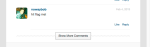
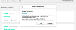

# 本地化字串{#localize-strings}

自訂Livefyre應用程式的字串。

您可自訂任何Livefyre應用程式中大部分HTML元素的文字字串。 這提供將轉譯的HTML元素文字（例如「貼文為」按鈕、「注釋計數」文字或「登入」按鈕）變更為任何有效UTF-8字串的彈性。 使用此功能為您的串流實作增添個性，或為您的使用者群在應用程式中本地化語言。

* 評論、聊天和即時部落格

   * [實施](#c-localize-strings/section_im4_224_xz)
   * [帳戶存取](#c-localize-strings/section_cm3_d24_xz)
   * [串流資訊](#c-localize-strings/section_wx1_c24_xz)
   * [串流排序](#c-localize-strings/section_ih2_124_xz)
   * [內容資訊](#c-localize-strings/section_llv_yd4_xz)
   * [精選內容](#c-localize-strings/section_gmw_vd4_xz)
   * [文字編輯器](#c-localize-strings/section_ky5_td4_xz)
   * [回應選項](#c-localize-strings/section_zvt_qd4_xz)
   * [注釋通告程式](#c-localize-strings/section_qqt_pd4_xz)
   * [錯誤訊息](#c-localize-strings/section_omz_jxn_xz)

* [時間和日期格式](#c-localize-strings/section_yz4_g5n_xz)
* [媒體牆](#c-localize-strings/section_vwt_d5n_xz)
* [地圖](#c-localize-strings/section_fxv_c5n_xz)
* [馬賽克](#c-localize-strings/section_e2s_b5n_xz)
* [轉盤](#c-localize-strings/section_l2z_hkn_xz)
* [功能卡](#c-localize-strings/section_mw2_hkn_xz)
* [民調問答](#c-localize-strings/section_pdg_fwh_xz)
* [Livefyre Identity](#c-localize-strings/section_zc3_xvh_xz)
* 更多:
   * [檢閱文字字串](/help/using/c-settings-other/c-translation-sets/c-review-text-strings.md#c_review_text_strings)
   * [Siesors](/help/using/c-settings-other/c-translation-sets/c-sidenotes-text-strings.md#c_sidenotes_text_strings)

## 實施 {#section_im4_224_xz}

若要實作此功能，請傳入您要覆寫之字串的1-1物件對應至JavaScript設定物件。 如果您未提供欄位，則會使用預設文字。

範例:

```
var customStrings = {     
   postAsButton: "New Post As Text",     
   postEditButton: "New Post Edit Text"  
};   
   convConfig["strings"] = customStrings; fyre.conv.load(     
   networkConfig,     
   [convConfig],     
   function(){}  
);
```

本頁列出可針對Livefyre核心應用程式自訂的所有文字字串。

## 帳戶存取{#section_cm3_d24_xz}

驗證程式和已驗證用戶菜單中可用的字串。


| 元素 | 金鑰 | 預設文字 |
|---|---|---|
|  | displayName | %s |
|  | editProfile | 編輯設定檔 |
|  | notificationSettings | 通知設定 |
|  | siteAdmin | 管理控制台（Studio的連結） |
|  | 登出 | 登出 |

## 串流資訊{#section_wx1_c24_xz}

可用於內容串流資訊和顯示的字串。 列出接聽的人數、應用程式的貼文數，以及允許使用者登入或存取其帳戶資訊。

| 金鑰 | 預設文字 | 串流資料 |
|---|---|---|
|  | commentCountLabelZero | %s注釋 |
|  | commentCountLabel | %s注釋 |
|  | commentCountLabelPlural | %s留言 |
|  | listenerCount | 監聽 |
|  | listenerCountPlural | 傾聽 |
|  | liveblogPostCountLabelZero | 公佈 |
|  | liveblogPostCountLabel | 公佈 |
|  | liveblogPostCountLabelPlural | 則貼文 |
| 線程選項 | threadBreakoutButton | 顯示整個線程 |
|  | toggleCollapse | 切換收合 |
| 高速／佇列注釋 | 刷新 | 重新整理 |
|  | newComment | 新留言 |
|  | newComments | 新留言 |
|  | newReply | 新回覆 |
|  | newReplies | 新回覆 |

## 串流排序{#section_ih2_124_xz}

允許使用者依年齡或人氣來排序傳回的內容。


| 金鑰 | 預設文字 | 頁首選項 |
|---|---|---|
|  | sortNewst | 最新 |
|  | sortOllest | 最舊 |
|  | sortTopComments | 熱門意見 |
|  | sortHotThreads | 熱線程 |
|  | sortSeparator |  |  |
|  | streamSorting | 正在載入 |
|  | topCommentsContentNotFoundMsg | 現在還沒有足夠的贊。 |
|  | hotThreadsContentNotFoundMsg | 目前還沒有足夠的線程。 |
|  | streamRefreshMsg | 查看新增功能。 |
| 頁尾選項 | archiveHeaderTitle | 從存檔 |
|  | archiveShowMore | 顯示更多 |
|  | showMore | 顯示更多注釋 |
|  | showMoreLiveblog | 顯示更多貼文 |



## 內容資訊{#section_llv_yd4_xz}

列出貼文資訊：使用者名稱、任何已套用的使用者標籤，以及貼文時間。

  

| 金鑰 | 預設文字 | 作者 |
|---|---|---|
|  | 協調者 | 協調者 |
|  | slasscardViewProfile | 檢視完整設定檔 |
| 貼文資訊 | timeJustNow | 剛才 |
|  | timeMinutesAgo | 分鐘前 |
|  | timeMinutesAgoPlural | 數分鐘前 |
|  | timeHoursAgo | 小時前 |
|  | timeHoursAgoPlural | 數小時前 |
|  | timeDaysAgo | 天前 |
|  | timeDaysAgoPlural | 天前 |
|  | likesPlural | 說讚的內容 |
|  | likesSingular | 讚 |
|  | 協調者EditTimestamp | 由協調者編輯 |
|  | commentTombstone | 此評論已刪除 |
|  | permalinkNotFoundMsg | 此注釋不再顯示。 |
|  | quickProfileTooltip | 快速設定檔 |

## 精選內容{#section_gmw_vd4_xz}

如果啟用，則特色內容會列在串流的頂端。

|  | 金鑰 | 預設文字 |
|---|---|---|
| 精選標籤 |  |  |
|  | featuredCommentsTag | 精選 |
|  | featuredCommentsTitlePlural | 精選注釋 |

## 文字編輯器{#section_ky5_td4_xz}

依預設，所有使用者都可在頁面頂端使用。


|  | 金鑰 | 預設文字 |
|---|---|---| 
| 編輯器按鈕 | follow | + 關注 |
|  | unfollow | -取消關注 |
|  | liveblogFollow | 關注即時部落格 |
|  | liveblog取消關注 | 取消關注即時部落格 |
|  | postButton（可供登入的使用者使用。） | 貼文留言 |
|  | postAsButton（適用於未驗證的使用者。） | 將留言張貼為…… |
|  | postEditButton | 編輯注釋 |
|  | postEditAsButton | 將注釋編輯為…… |
|  | postEditCancelButton | 取消 |
|  | editorDisabled | 此對話目前不提供新意見。 |
| 聊天選項 | livechatPostButtonLabel | 貼文 |
|  | livechatPostEditButton | 編輯 |
|  | livechatWindowsInstruction | 按Ctrl+Enter鍵張貼 |
|  | livechatOtherInstruction | 按命令+Enter鍵張貼 |

## 響應選項{#section_zvt_qd4_xz}

除非另有說明，否則可供所有登入的使用者使用。 將滑鼠移至內容面板上以存取。


| 金鑰 | 預設文字 |  |
|---|---|---|
| 使用者回應選項 | 適用於使用者。 |  |
| flagButton | 標幟 |
|  | flagCommentTooltip | 標幟 |
|  | editButton（僅供作者和協調者使用，如果已啟用。） | 編輯 |
|  | deleteButton（若已啟用，則僅供作者和協調者使用。） | 刪除 |
|  | deleteCommentTooltip | 刪除 |
|  | shareButton | 共用 |
|  | shareCommentTooltip | 共用 |
|  | likeButton | 讚 |
|  | 不同於按鈕 | 收回讚 |
|  | replyButton | 回覆 |
|  | replyButtonSingular（適用於聊天和即時部落格。） | 回覆 |
|  | replyButtonPlural（適用於聊天和即時部落格。） | 回覆 |


| 金鑰 | 預設文字 |  |
|---|---|---|
| 標幟模式 | flagTitle | 標籤%s的注釋 |
|  | flagSubtitle | 標幟為 |
|  | flagDefaultSelectOption | 選擇 |
|  | flagSpam | 垃圾訊息 |
|  | flagSpamButton | 垃圾訊息 |
|  | flagSpamCommentTooltip | 垃圾訊息 |
|  | flagOffension | 進攻性 |
|  | flagOffensionButton | 進攻性 |
|  | flagOffensionCommentTooltip | 進攻性 |
|  | flagSaveries | 不同意 |
|  | flagDiscoverButton | 不同意 |
|  | flagDiscoverCommentTooltip | 不同意 |
|  | flagOffTopic | 關閉主題 |
|  | flagOfftopicButton | 關閉主題 |
|  | flagOfftopicCommentTooltip | 關閉主題 |
|  | flagEmail | 「電子郵件」 |
|  | flagEmailPlaceholder | you@example.com |
|  | flagNotes | 附註 |
|  | flagNotesPlaceholder | 從這裡開始輸入…… |
|  | flagConfirmButton | OK |
|  | flagCancelButton | 取消 |
|  | flagConfirmationMessage | 是否將%s的注釋標幟為%s? |
|  | flagSuccessMsg | 留言已標籤。 |


| 金鑰 | 預設文字 |  |
|---|---|---|
| 共用模式 | shareTitle | 分享意見 |
|  | sharePlaceholderText | 你覺得呢？ |
|  | shareLabel | 分享於： |
|  | shareTextTwitter | 空白 |
|  | shareTextFacebook | 空白 |
|  | shareTextLinkedin | 空白 |
|  | shareButtonText | 共用 |
|  | sharePermalink | 佩馬林克 |
|  | 載入永久連結 | 正在載入短URL... |
|  | shareText | 我剛發了條評論。 看看！ |


| 金鑰 | 預設文字 |  |
|---|---|---|
| 回覆模式 | postReplyAsButton | 將留言張貼為…… |
|  | postReplyButton（可供登入的使用者使用）。 | 貼文留言 |
|  | backToHotThreads | 返回到熱線程 |


| 金鑰 | 預設文字 |  |
|---|---|---|
| Twitter @turtience modal | 提及次數標題 | 分享提及次數 |
|  | tinterSubtitleTwitter | 分享推文至： |
|  | 提及次數DefaultText | 我在Livefyre評論中提到過你！ |
|  | 提及次數ConfirmButton | 確定 |
|  | 提及次數CancelButton | 取消 |
|  | 提及次數ErrorGeneral | 糟了！ 出了點問題！ Livefyre已收到警報。 |
|  | 提及次數ErrorNoneSelected | 您必須至少啟用一個提及。 |
|  | 提及次數功能表標題 | 去看和提及你的朋友 |
|  | 提及次數TwitterConnect | 連線至Twitter |
|  | 提及次數TwitterFeching | 正在獲取朋友…… |
|  | tuniterSuccessMsg | 提及次數已成功傳送。 |



| 金鑰 | 預設文字 |  |
|---|---|---|
| 編輯模式 | 適用於Studio管理員、使用者管理員或主持者 |  |
| @(@intiture)。 | &lt;/>（開啟自訂html視窗）。 |  |
|  | customHtmlDialogTitle（以模型標題的形式顯示）。 | 新增自訂HTML |


| 金鑰 | 預設文字 |  |
|---|---|---|
| 協調者回應選項 | 適用於Studio管理員、使用者管理員或協調者。 |  |
| pendingComment | pending |
|  | banUserButton | 禁止使用者 |
|  | banUserTooltip | 禁止使用者 |
|  | bozoButton | 博佐 |
|  | bozoCommentTooltip | 博佐 |
|  | featureButton | 功能 |
|  | featureCommentTooltip | 功能 |
|  | unfeatureButton | 取消功能 |
|  | featuredCommentTooltip | 取消功能 |


| 金鑰 | 預設文字 |  |
|---|---|---|
| 禁止使用者模式 | 適用於Studio管理員、使用者管理員或協調者。 |  |
| banTitle | 禁止使用者 |  |
|  | banConfirmation | 您確定要禁止此使用者嗎？ |
|  | banConfirmButton | 確定 |
|  | banCancelButton | 取消 |

## 注釋通告程式{#section_qqt_pd4_xz}

若已啟用，則位於頁面底部的所有Livefyre對話應用程式。


|  | 金鑰 | 預設文字 |
|---|---|---|
| 通告程式標籤 | 注釋通告程式 | 新留言 |
|  | commentNotifierPlural | 新留言 |
|  | liveblog通告程式 | 新增貼文 |
|  | liveblogNotifierPlural | 新增貼文 |

## 錯誤訊息 {#section_omz_jxn_xz}

可自訂錯誤訊息的字串。

| 金鑰 | 預設文字 |
|---|---|
| errorAuthError | 您無權對此對話發表意見 |
| errorCommentsNotAllowed | 此對話不允許留言 |
| errorDefault | 發生錯誤. 請再試一次。 |
| errorDuplicate | 雖然您很喜歡您的意見，但您不得張貼兩次。 |
| errorEditDuplicate | 編輯注釋時，必須更改注釋的正文。 |
| errorEditNotAllowed | 您無法編輯此對話的留言。 |
| errorEditTimeExceeded | 抱歉，您的留言編輯期間已過期。 |
| errorEmpty | 您似乎在嘗試張貼空白的留言。 |
| errorExpired | 您的作業已過期。 請重新載入頁面。 |
| errorFlagNotSelected | 請選擇標幟類型。 |
| errorGuestLiked | 抱歉，只有有帳戶的人才能喜歡內容。 |
| errorIndeficedPermissions | 權限不足 |
| errorInvalidChar | 您似乎在嘗試張貼無效字元。 |
| errorLikeOwnComment | 您不能喜歡自己的評論 |
| errorFormathed | 您似乎在嘗試張貼格式錯誤的內容。 |
| errorMaxChars | 抱歉，您的評論太長了。 請編輯並再試一次。 |
| errorMediaNotAvailable | 介質不再可見。 |
| errorShowMore | 載入更多注釋時出錯。 |
| MultipleMediaNotAllowedError | 您的權限一次只授予您一個介質附件。 |

## 時間和日期格式{#section_yz4_g5n_xz}

翻譯和自訂日期在視覺化應用程式內的內容卡上的顯示方式。

| 金鑰 | 預設文字 |
|---|---|
| hoursAgo | {number}h |
| hoursAgoSingular | {number}h |
| justNow | 1 次數 |
| minutesAgo | {number}m |
| minutesAgoSingular | {number}m |
| monthDayFormat | {day} {monthAbbrev} |
| monthDayYearFormat | {day} {monthAbbrev} {year} |
| monthNames | 1 月、2 月、3 月、4 月、5 月、6 月、7 月、8 月、9 月、10 月、11 月、12 月 |
| monthNamesAbbrev | 1月、2月、3月、4月、5月、6月、7月、8月、9月、10月、11月、12月 |
| secondsAgo | {number}s |
| secondsAgoSingular | {number}s |

## 介質牆{#section_vwt_d5n_xz}

媒體塗鴉牆應用程式的可用字串。

| 金鑰 | 預設文字 |
|---|---|
| featuredText | 精選 |
| shareButtonText | 共用 |

| 金鑰 | 預設文字 |
|---|---|
| postButtonText | 您在想什麼？ |
| postModalTitle | 張貼您的留言 |
| postModalButton | 張貼您的留言 |
| postModalPlaceholder | 你想說什麼？ |
| showMoreButtonText | 載入更多 |
| shareButtonText | 共用 |

## 地圖 {#section_fxv_c5n_xz}

地圖可用的字串。

| 金鑰 | 預設文字 |
|---|---|
| featuredText | 精選 |
| shareButtonText | 共用 |

## 馬賽克{#section_e2s_b5n_xz}

Mosaics的字串可用。

| 金鑰 | 預設文字 |
|---|---|
| featuredText | 精選 |
| shareButtonText | 共用 |

## 轉盤 {#section_l2z_hkn_xz}

可用於轉盤的字串。

| 金鑰 | 預設文字 |
|---|---|
| featuredText | 精選 |
| shareButtonText | 共用 |

## 功能卡{#section_mw2_hkn_xz}

功能卡的字串可用。

| 金鑰 | 預設文字 |
|---|---|
| featuredText | 精選 |
| shareButtonText | 共用 |

## 上傳應用程式{#section_grc_gkn_xz}

上傳應用程式的可用字串。

| 金鑰 | 預設文字 |
|---|---|
| postButtonText | 您在想什麼？ |
| postModalTitle | 張貼您的留言 |
| postModalButton | 張貼您的留言 |
| postModalTitlePlaceholder | 輸入標題 |
| postModalPlaceholder | 你想說什麼？ |
| postModalConfirationTitle | 感謝您的發佈！ |
| postModalConfirmationMessage | 您的貼文正在檢閱中。 |
| postModalConfirmationButton | 完成 |
| title |  |
| 訊息 |  |
| editorErrorAttachmentsRequired | 需要附件 |
| editorErrorBody | 請新增訊息 |
| editorErrorDuplicate | 雖然您很喜歡您的註解，但是無法張貼兩次 |
| editorErrorGeneric | 發生錯誤 |
| editorErrorTitleRequired | 需要標題 |

## 民調問答 {#section_pdg_fwh_xz}

輪詢可用的字串。

| 金鑰 | 預設文字 |
|---|---|
| totalTemetsLabel | %s總票數 |
| shareStringText | 我剛投了%s票，您的投票是什麼？ |
| pollClosedLabel | 此民調問答目前已關閉 |

## Livefyre Identity {#section_zc3_xvh_xz}

Livefyre Identity的可用字串。

| 金鑰 | 預設文字 |
|--- |--- |
| automaticallyFollowTanvess | 自動關注我加入的對話 |
| back | 上一步 |
| 生物 | 簡歷 |
| creat | 建立 |
| createANewAccount | 建立新帳戶 |
| createNewAccountWithEmail | 使用電子郵件建立新帳戶 |
| changeAvatar | 變更頭像 |
| chooseFile | 選擇檔案 |
| completeAccount | 完整帳戶 |
| emailWhenSoperyReflies | 當有人回覆我時，以電子郵件寄送 |
| emailCommentsIFollow | 在我所關注的對話中，以電子郵件發表意見 |
| emailSenttoResetPassword | 電子郵件已傳送！ 檢查收件箱中是否有重設密碼的連結 |
| emailVerificationSent | 電子郵件驗證已傳送 |
| firstName | 名字 |
| forgotPassword | 忘記密碼？ |
| forgotYourPassword | 忘記密碼？ |
| forgotYourPasswordInstructions | 請在下方輸入您的使用者名稱或電子郵件地址，我們會寄送連結給您以變更密碼。 |
| formInputCloseButtonText | Close |
| formInputCancelButtonText | 取消 |
| formInputSaveButtonText | 儲存 |
| hasNotLeftAnyComments | 沒有留下任何評論 |
| locationIsFrom | 來自 |
| labelAvatar | 阿凡達 |
| labelComments | 意見 |
| labelConfirmNewPassword | 確認新密碼 |
| labelConfirmPassword | 確認密碼 |
| labelEmail | Email Address |
| labelLikes | 說讚的內容 |
| labelLoading | 正在載入 |
| labelNewPassword | 新密碼 |
| labelNotification | 通知 |
| labelPassword | 密碼 |
| labelProfile | 描述檔 |
| labelUsername | 使用者名稱 |
| labelUsernameOrEmail | 使用者名稱或電子郵件 |
| lastName | 姓氏 |
| livefyreAccount | Livefyre帳戶 |
| 位置 | 位置 |
| 載入描述檔 | 載入描述檔 |
| newPassword | 新密碼 |
| oldPassword | 舊密碼 |
| on | on |
| 或  | 或  |
| passwordLinkExpired | 您點按以重設密碼的連結已過期。 再次重設密碼，我們會傳送新連結給您。 |
| pleasecheckEmailToComplete | 請檢查您的電子郵件以完成註冊。 |
| 已張貼 | 已張貼 |
| poweredBy | powered by |
| profileNotificationImmediate | immediate |
| profileNotificationHourly | 每小時 |
| profileNotificationNever | never |
| recentComments | 最近的注釋 |
| 重設 | 重設 |
| resetPassword | 重設密碼 |
| signIn | 登入 |
| signInWith | 登入方式 |
| signInWithEmail | 使用電子郵件登入 |
| 註冊 | 註冊 |
| socialAccount | 社交帳戶 |
| successPasswordChanged | 成功! 您的密碼已變更，您現在已登入 |
| termsAndConditions | 條款與條件 |
| termsAndConditionsIntro | 註冊即可接受 |
| termsOfUse | 使用條款 |
| termsOfUseIntro | 登入即表示您同意 |
| thisUser | 此使用者 |
| verifyPassword | 驗證密碼 |
| fileSizeLimit | 最大2MB |
| accountnotfound | 找不到帳戶 |
| avatarImageExceedSize | 您的頭像影像已超過2MB檔案限制 |
| fieldrequired | 欄位僅接受整數 |
| fiellyacceptsavalidemail | 欄位僅接受有效的電子郵件 |
| fieldonlyacceptsleters | 欄位僅接受字母 |
| filezemustbelessthanMB | 檔案大小必須小於{#}MB |
| invalidusernameorpassword | 用戶名或密碼無效 |
| 字元最小長度 | {#}字元的最小長度 |
| 最大長度字元 | 字元長度上限{#} |
| therewasanerror | 發生錯誤 |
| this fieldrequired | 此為必填欄位。 |
| validfileextensions | 有效的副檔名 |
| 值ustmatch | 值必須符合 |
| passwordLength | 長度為6到32個字元。 |
| passwordCharacters | 同時包含小寫和大寫字元。 |
| passwordSymbols | 至少包含一個數字和一個符號。 |
| passwordUsername | 不包含您的使用者名稱。 |
| passwordPoverTitle | 您的密碼需要： |
| passwordErrorContainsFirstName | 您輸入的密碼包含您的使用者名稱、名字或姓氏。 出於安全原因，請輸入不包含您的用戶名、名字或姓氏的密碼。 另請記住，您的密碼必須包含：6到32個字元大寫字元A小寫字元A符號 |
| passwordErrorContainsLastName | 您輸入的密碼包含您的使用者名稱、名字或姓氏。 出於安全原因，請輸入不包含您的用戶名、名字或姓氏的密碼。 另請記住，您的密碼必須包含：6到32個字元大寫字元A小寫字元A符號 |
| passwordErrorContainsUsername | 您輸入的密碼包含您的使用者名稱、名字或姓氏。 出於安全原因，請輸入不包含您的用戶名、名字或姓氏的密碼。 另請記住，您的密碼必須包含：6到32個字元大寫字元A小寫字元A符號 |
| passwordErrorTooShort | 密碼字元最少6個字元 |
| passwordErrorTooLong | 密碼最多32個字元 |
| passwordErrorMissingUpperase | 密碼應至少包含一個大寫字元 |
| passwordErrorMissingLowercase | 密碼至少應包含一個小寫字元 |
| passwordErrorMissingSymbol | 密碼應至少包含集`!@#$%^&*()?.,<>\’;:”[]{}|`中的一個符號 |


