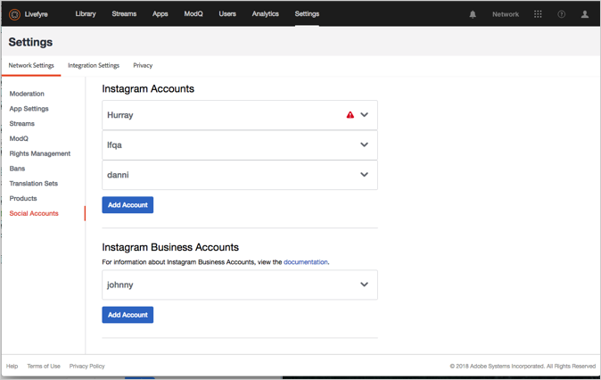

# 新增Social帳戶{#add-a-social-account}

設定社交帳戶以請求權限或在串流或社交搜尋中搜尋UGC。

Livefyre使用Twitter和Instagram社交帳戶，讓您執行社交搜尋(在程式庫中)或使用串流。

您必須在Twitter中設定帳戶，才能在程式庫中使用Twitter社交搜尋。

Instagram具有不同的社交帳戶規則，視您使用Adobe Livefyre而定。如需您可用於Livefyre的社交帳戶類型的詳細資訊，請參閱 [關於Instagram帳戶](/help/using/c-users-creating-accounts-with-studio-access/t-configure-social-accout-instagram/c-about-instagram-accounts.md#c_about_instagram_accounts)。

若要設定社交帳戶：

1. 導覽至 **[!UICONTROL Settings >]****[!UICONTROL Network Settings.]**
1. 導覽至下一 **[!UICONTROL Social Accounts]** 節 **[!UICONTROL Network Settings]**。
1. 按一下 **[!UICONTROL Add Account]** 您要新增的社交帳戶類型。出現對話方塊彈出畫面，讓您授權Livefyre帳戶。

   

   >[!NOTE]
   >
   >當您設定Instagram商務帳戶時，會將您帶到Facebook登入畫面。繼續以正常方式登入。  >

1. 按一下 **[!UICONTROL Authorize App]** 以繼續。
1. 新增帳戶， **[!UICONTROL Display Name]** 然後按一下 **[!UICONTROL Save Settings.]**。在帳戶資訊方塊的標題中按一下， **[!UICONTROL Social Account]** 收合帳戶。
