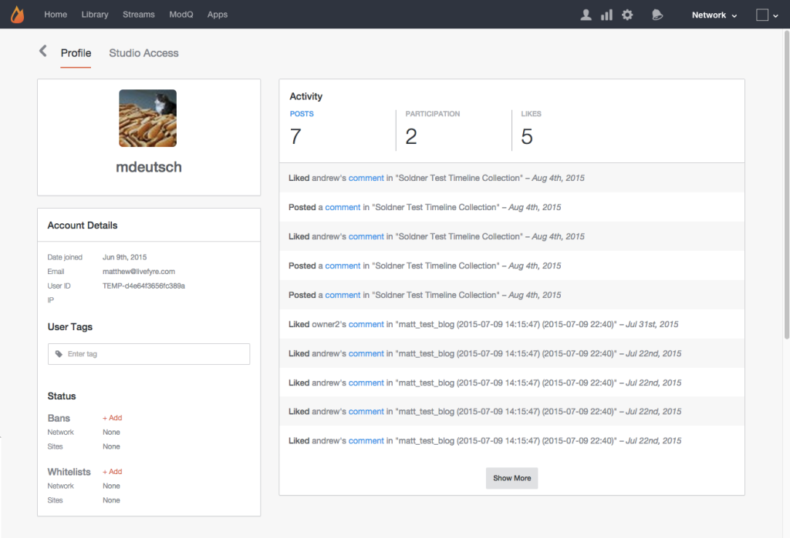

# 檢視帳戶詳細資訊{#viewing-account-details}

按一下任何使用者，即可檢視帳戶的詳細資訊。

## 描述檔 {#section_mpn_ttp_vz}

「描述檔」頁面提供使用者帳戶資訊，包括帳戶建立日期、使用者ID和與其關聯的電子郵件地址、帳戶的所有使用者活動清單，以及任何相關的使用者標籤、禁令或白名單清單。

>[!NOTE]
>
>這些資訊僅供Studio管理員、Studio管理員和使用者管理員使用。 若要封鎖此檢視中使用者的IP和電子郵件地址，請連絡您的Livefyre技術客戶經理。

## 使用者標籤 {#section_vk2_stp_vz}

將「使用者標籤」新增至帳戶，以更輕鬆地搜尋標籤的使用者，並在時尚上區隔標籤使用者的內容與網站上的其他使用者。

如需使用「使用者標籤」來設定使用者內容與網站上其他內容不同樣式的詳細資訊，請參閱 **[!UICONTROL App Customizations > Style User Group Content]**。

>[!NOTE]
>
>使用者標籤不區分大小寫，且可能包含空格。

## 狀態 {#section_yhn_rtp_vz}

「狀態」區段會列出任何與「帳戶」相關的「禁止」或「白名單」，並允許您將帳戶新增至任何現有的「網路」或「網站禁令」和「白名單」。

## 禁止用戶 {#section_l5b_5gr_vdb}

如果使用者在文章或您的網站上張貼不適當或垃圾訊息，您可以選擇禁止使用者進入您的網路。 一旦禁用，使用者張貼的所有內容都會自動設為 ***Bozo*** ，而且只會對張貼使用者顯示。 被禁用的使用者可登入串流、張貼留言，以及在應用程式中檢視其內容。 被禁用的用戶會認為，他們仍然是對話的一部分。 不過，您網站上的其他使用者將無法看到此內容。

由於其內容現在是Bozo的內容，所以被禁用的使用者可能會繼續張貼不適當的內容，但您的社群將無法再看到。

For more information, please see **[!UICONTROL Studio > App Content > Bozo Content]**.

## 白名單使用者 {#section_kr4_ptp_vz}

白名單使用者可讓他們直接張貼至您的應用程式。 白名單使用者張貼的內容不會透過Livefyre的SAFE、粗俗或預先協調篩選，而且會自動核准並新增至應用程式。
