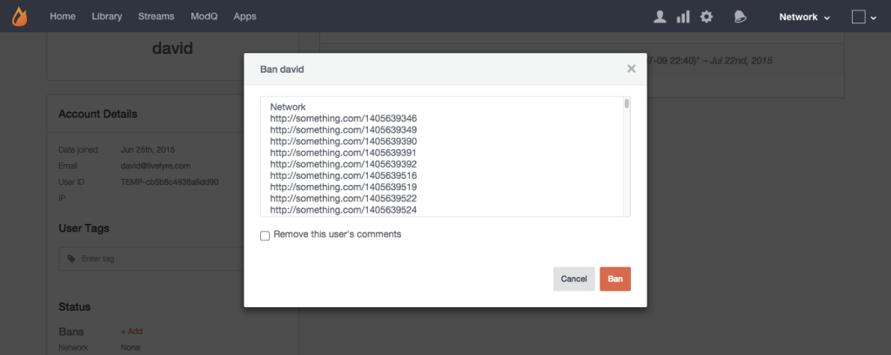

# 禁止用戶{#ban-a-user}

您可以禁止Livefyre應用程式中的內嵌使用者，而透過Livefyre登入的使用者也可能被禁止進入Studio的「資料庫>應用程式內容」頁面。

要從「用戶」頁禁止用戶：

1. 按一下&#x200B;**[!UICONTROL +Add]**&#x200B;表示&#x200B;**[!UICONTROL Bans]**。
1. 此時會出現一個彈出畫面，允許您禁止整個網路或特定網站的使用者。 （使用CTR或Command鍵選取多個網站。）
1. 按一下&#x200B;**[!UICONTROL Remove this user’s comments]**&#x200B;可禁止使用者、Bozo任何先前的貼文，並從串流中移除這些貼文。 將此方塊保留為未勾選，僅限Bozo未來來自被禁止使用者的貼文。
1. 按一下&#x200B;**[!UICONTROL Ban]**&#x200B;完成該過程。
