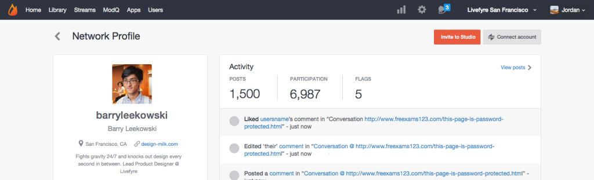

# 連結使用者帳戶{#link-user-accounts}

將您的Studio帳戶連結至您的Livefyre帳戶，以從單一位置協調或管理您的所有Livefyre網站或網路。

>[!NOTE]
>
>若要與Livefyre應用程式互動（例如，請留下註解、新增Sidexear或共用內容），您必須使用您的Livefyre帳戶使用者名稱和密碼登入，而非使用您的Studio帳戶使用者名稱和密碼登入。

若要連結帳戶：

1. 在您的網路上建立Livefyre使用者設定檔後，登入Studio。
1. 前往&#x200B;**[!UICONTROL Users]**，尋找您的使用者設定檔，然後按兩下以檢視詳細資訊。
1. 按一下 **[!UICONTROL Connect account]**.
1. 在開啟的視窗中，選取要連結至此帳戶的使用者帳戶。
1. 確認&#x200B;**[!UICONTROL Link Profile]**&#x200B;資訊，然後按一下&#x200B;**[!UICONTROL Link]**。

