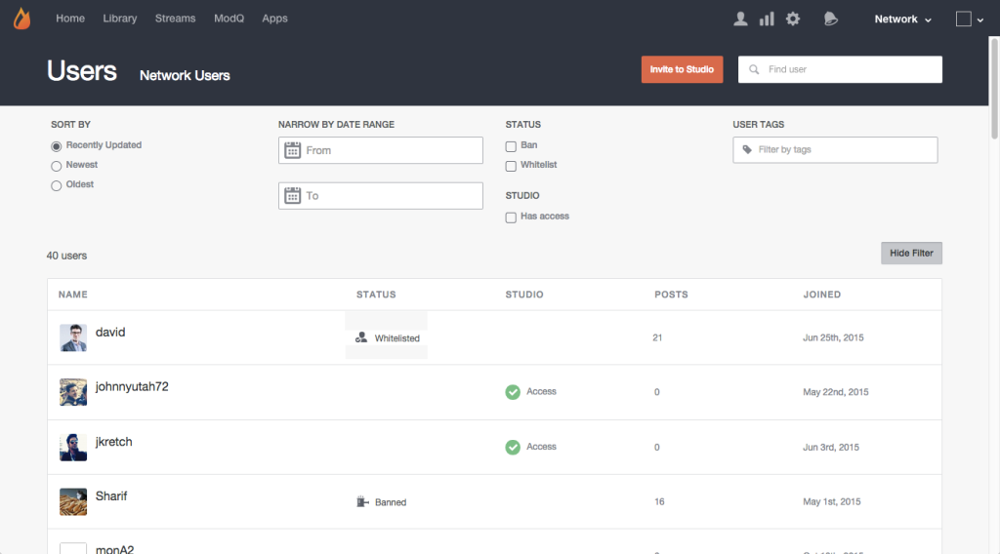

# 搜索用戶{#search-for-users}

使用頁面頂端的「搜尋」欄位，依顯示名稱、使用者ID、電子郵件地址或網站訪客加入Livefyre網路的日期來搜尋網站訪客。

>[!NOTE]
>
>這些欄位支援萬用字元搜尋。

1. 按一下&#x200B;**[!UICONTROL Show Filter]**&#x200B;以開啟可篩選列出使用者的面板。
1. **[!UICONTROL Sort by]** 更新至列出的使用者帳戶：最近更新、最新或最舊。
1. **[!UICONTROL Narrow by Date Range]** 以僅列出在輸入範圍期間添加的用戶帳戶。
1. 僅列出&#x200B;**[!UICONTROL Banned]**&#x200B;或&#x200B;**[!UICONTROL Whitelisted]**&#x200B;使用者。
1. 僅列出&#x200B;**[!UICONTROL Studio]**&#x200B;用戶。
1. 僅列出附帶輸入&#x200B;**[!UICONTROL User Tags]**&#x200B;的帳戶。

